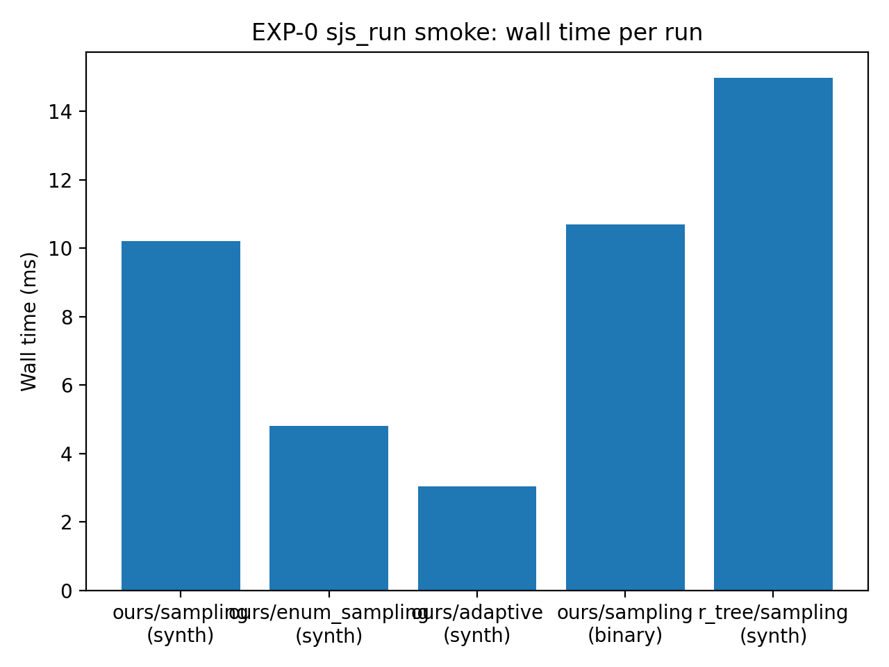
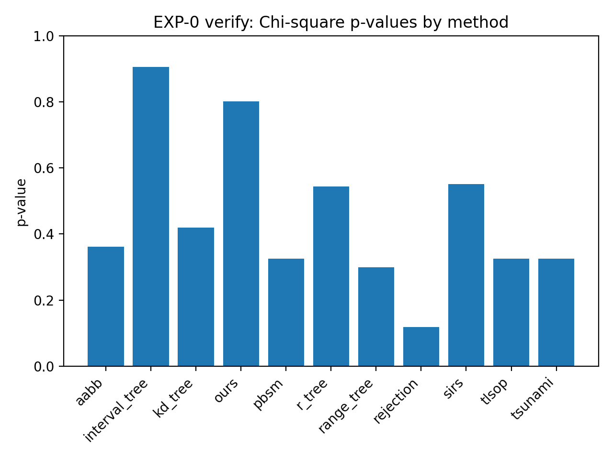
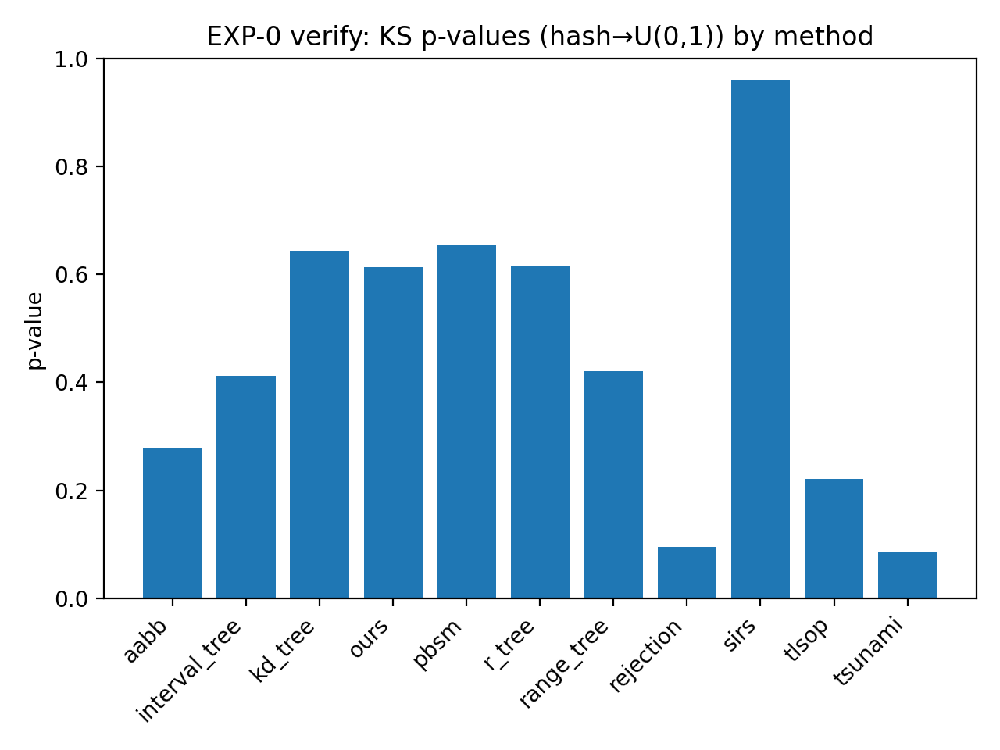
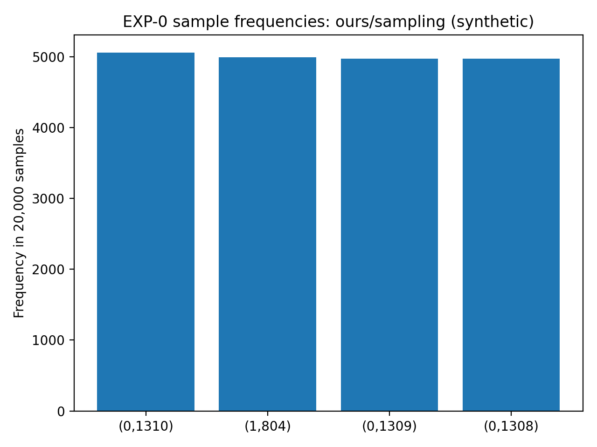
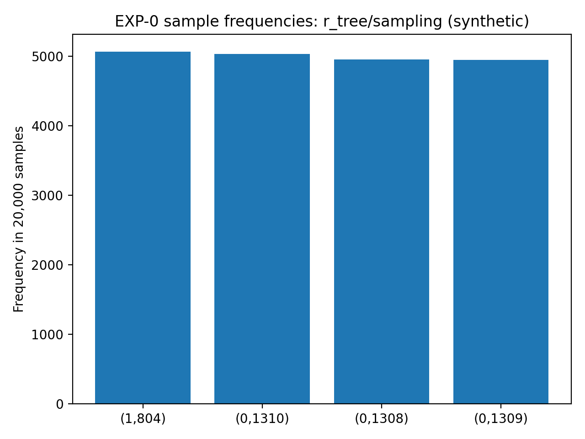

# EXP-0 实验报告：基础 Sanity（单元级 + 端到端 Smoke）

- 结果来源：`exp0_result.zip`（已解压并解析 run.csv / verify 日志 / 样本 tsv）

- 报告生成时间：2025-12-29 15:16:15 UTC


---

## 1. 实验的设计

### 1.1 实验定位与目标

EXP-0 是整套实验的“启动前自检”，不用于支撑论文主结论，也不用于对比性能。
它的唯一目标是：在进入 EXP-1～EXP-N 之前，确认 **环境、几何语义（half-open）、join 流程、采样输出链路** 均正确可用。

EXP-0 重点回答三个问题：
1) 工程能否从零构建并通过单元测试？
2) 端到端（生成数据→运行方法→写出结果）是否能跑通？
3) 在小规模可算真值（oracle）的情况下，各方法输出的样本是否都落在正确的 join universe 内（missing=0），并输出基本的质量 sanity 指标（χ²/KS/自相关）。


### 1.2 任务语义与通过判据

- 数据对象：二维轴对齐矩形盒（AABB）。
- 相交语义：half-open `[lo, hi)`（边界贴合不算相交）。
- Join 结果：`J = {(r,s) | r∈R, s∈S, r∩s≠∅}`。
- 采样目标：从 `J` 中抽取 `t` 个 **均匀、有放回、i.i.d.** 样本对。

EXP-0 的硬门槛（脚本 enforce）：
- `ctest` 全部通过；
- `sjs_run` 端到端 smoke 的输出目录必须包含 `run.csv`；
- `sjs_verify` 中 **`missing_in_universe=0`**（任何方法非零直接判 FAIL）；
- 对标记为 `(exact)` 的计数结果，必须 `count == oracle` 且 `rel_err == 0`；
- 对标记为 `(est)` 的计数结果默认只 warning（可通过开关改为 gate）。


### 1.3 执行流程（以 run_exp0.sh 为准）

本次 EXP-0 按脚本的 Step 1～5 执行：

1. **Clean build + compile**：清理并重建 build 目录，生成 `sjs_gen_dataset / sjs_run / sjs_verify`；
2. **ctest**：几何、事件扫描、oracle、baseline smoke、质量工具等单元/集成测试；
3. **生成小规模 stripe 合成数据**：写出 bin/csv，并记录生成器报告；
4. **sjs_run 端到端 smoke**：
   - ours: `sampling / enum_sampling / adaptive`（synthetic on-the-fly）
   - ours: `sampling`（binary path）
   - r_tree: `sampling`（regression guard）
5. **sjs_verify（oracle + 质量 sanity）**：
   - methods：ours, aabb, interval_tree, kd_tree, r_tree, range_tree, pbsm, tlsop, sirs, rejection, tsunami
   - 强制检查 missing=0；exact count 必须与 oracle 一致。

此外脚本支持可选的 ASAN/UBSAN 模式（RUN_ASAN=1），用于快速捕捉历史上容易崩溃的路径（例如 r_tree）。


---

## 2. 实验的结果

### 2.1 运行环境与参数

本次运行的环境快照与参数来自 `results/raw/exp0/logs/env.txt`：

```text
date: 2025-12-24T09:16:55+00:00
uname: Linux ta 5.4.0-216-generic #236-Ubuntu SMP Fri Apr 11 19:53:21 UTC 2025 x86_64 x86_64 x86_64 GNU/Linux
cmake: cmake version 4.2.0
ctest: ctest version 4.2.0
git_head: 34415f3
git_status:
resolved_params:
  BUILD_TYPE=Release
  CLEAN_BUILD=1
  JOBS=128
  THREADS=1
  NR=2000
  NS=2000
  ALPHA=1e-3
  GEN_SEED=1
  T=20000
  SEED=1
  ORACLE_MAX_CHECKS=50000000
  RUN_ASAN=0
  CHECK_EST_COUNT=0
  EST_REL_ERR_MAX=0.5
  EST_REL_ERR_WARN=0.5
```

### 2.2 Step 2：ctest 结果

ctest 通过情况（节选日志末尾）：

```text
    Start 4: sjs_test_sampling_quality
4/8 Test #4: sjs_test_sampling_quality ............   Passed    0.00 sec
    Start 5: sjs_test_baselines_smoke
5/8 Test #5: sjs_test_baselines_smoke .............   Passed    0.01 sec
    Start 6: sjs_test_write_results
6/8 Test #6: sjs_test_write_results ...............   Passed    0.00 sec
    Start 7: sjs_test_rtree_sampling_uniformity
7/8 Test #7: sjs_test_rtree_sampling_uniformity ...   Passed    0.01 sec
    Start 8: sjs_test_rtree_split_regression
8/8 Test #8: sjs_test_rtree_split_regression ......   Passed    0.01 sec

100% tests passed, 0 tests failed out of 8

Total Test time (real) =   0.04 sec
```

### 2.3 Step 3：数据生成（stripe_ctrl_alpha）

生成器报告（来自 `gen_dataset.log` 中的 JSON）：

```json
{
  "generator": "stripe_ctrl_alpha",
  "dataset": "exp0",
  "n_r": 2000,
  "n_s": 2000,
  "has_exact_k": true,
  "k_target": 4,
  "k_achieved": 4,
  "alpha_target": 0.001,
  "alpha_achieved": 0.001,
  "notes": "control_axis=1, core=[0.45,0.55], g=4.9975e-05, h=0.00045, delta=1.24938e-05, shuffle_strips=1, shuffle_r=0, k_overridden=0"
}
```

要点：本次生成的数据集满足 `k_target = k_achieved = 4`，即 **oracle join 大小 |J| = 4**，这是 EXP-0 典型的“极小 join universe”配置，用于强 correctness 钉子。

### 2.4 Step 4：sjs_run 端到端 smoke（run.csv 汇总）

下表汇总了脚本 Step 4 产生的 5 次 smoke run 的关键字段（来自各自目录下的 `run.csv`）：

| Run目录                          | Dataset          | Method   | Variant       |   Wall(ms) |   Count |   Exact |   UsedEnum | AdaptiveBranch   |   PilotPairs |
|:---------------------------------|:-----------------|:---------|:--------------|-----------:|--------:|--------:|-----------:|:-----------------|-------------:|
| run_ours_sampling_synthetic      | exp0_synthetic   | ours     | sampling      |     10.213 |       4 |       1 |          0 | nan              |            0 |
| run_ours_enum_sampling_synthetic | exp0_synthetic   | ours     | enum_sampling |      4.81  |       4 |       1 |          1 | nan              |            0 |
| run_ours_adaptive_synthetic      | exp0_synthetic   | ours     | adaptive      |      3.045 |       4 |       1 |          1 | enumerate_all    |            4 |
| run_ours_sampling_binary         | exp0_binary      | ours     | sampling      |     10.706 |       4 |       1 |          0 | nan              |            0 |
| run_r_tree_sampling_synthetic    | exp0_rtree_smoke | r_tree   | sampling      |     14.992 |       4 |       1 |          0 | nan              |            0 |


**图 1：不同 smoke run 的 wall time（ms）**



### 2.5 Step 5：sjs_verify（oracle + 质量 sanity）

各方法在 `sampling` 模式下的 verify 关键结果汇总（来自 `logs/verify_*_sampling.log`）：

| **方法 (Method)** | **计数类型** | **观测值 (Count)** | **真实值 (Oracle)** | **相对误差 (RelErr)** | **缺失率 (Missing)** | **Chi2_p** | **KS_p** | **自相关 (lag1)** | **最大频率误差** |
| ----------------- | ------------ | ------------------ | ------------------- | --------------------- | -------------------- | ---------- | -------- | ----------------- | ---------------- |
| **aabb**          | exact        | 4                  | 4                   | 0                     | 0                    | 0.3617     | 0.2772   | 0.0006            | 0.0198           |
| **interval_tree** | exact        | 4                  | 4                   | 0                     | 0                    | 0.9053     | 0.4126   | -0.003            | 0.0082           |
| **kd_tree**       | exact        | 4                  | 4                   | 0                     | 0                    | 0.4192     | 0.6436   | 0.0102            | 0.0186           |
| **ours**          | exact        | 4                  | 4                   | 0                     | 0                    | 0.8008     | 0.6139   | 0.0125            | 0.0118           |
| **pbsm**          | exact        | 4                  | 4                   | 0                     | 0                    | 0.3258     | 0.6544   | 0.0056            | 0.021            |
| **r_tree**        | exact        | 4                  | 4                   | 0                     | 0                    | 0.5441     | 0.6141   | 0.0071            | 0.0132           |
| **range_tree**    | exact        | 4                  | 4                   | 0                     | 0                    | 0.2991     | 0.4202   | 0.0027            | 0.018            |
| **rejection**     | **est**      | 5.1868             | 4                   | 0.2967                | 0                    | 0.1178     | 0.096    | 0.0066            | 0.027            |
| **sirs**          | exact        | 4                  | 4                   | 0                     | 0                    | 0.5505     | 0.9593   | -0.0009           | 0.0172           |
| **tlsop**         | exact        | 4                  | 4                   | 0                     | 0                    | 0.3258     | 0.2209   | 0.002             | 0.021            |
| **tsunami**       | exact        | 4                  | 4                   | 0                     | 0                    | 0.3258     | 0.0859   | -0.0009           | 0.021            |


**图 2：χ² p-value（按方法）**




**图 3：KS p-value（hash→U(0,1)）（按方法）**



### 2.6 样本内容示例：ours / r_tree 的 pair 频率

EXP-0 的 join universe 只有 4 个 pair，因此在 `t=20000` 的采样下，样本中应出现 4 个 pair，且频率应接近均匀（约 5000/类）。


**图 4：ours/sampling（synthetic）样本中 4 个 pair 的出现次数**




**图 5：r_tree/sampling（synthetic）样本中 4 个 pair 的出现次数**




---

## 3. 对实验及其结果的分析

### 3.1 Correctness：硬门槛全部满足，结果理想

从脚本定义的硬门槛看，本次 EXP-0 结果非常“干净”：

- **ctest 100% 通过**：几何 half-open、事件扫描、oracle、baseline smoke、R-tree 回归等底座语义可信；
- **oracle 真值 |J|=4** 且所有 `(exact)` 方法返回 `count=4, rel_err=0`；
- **所有方法 `missing_in_universe=0`**：意味着采样输出的每一个 pair 都能在 join universe 中找到（不会“采出 join 之外的 pair”），这是 EXP-0 最核心的 correctness 钉子。

### 3.2 质量 sanity：在极小 universe 下表现正常，但统计说服力有限

verify 输出的 χ²/KS p-value、自相关等指标没有出现明显红旗（例如大面积 p<0.05 或显著自相关），说明采样输出没有“明显偏差/相关性”的异常。

但需要强调：由于本次 **|J|=4** 极小，质量检验更适合被理解为 *sanity check*：
- χ²/KS 在这种“只有 4 类”的情况下统计功效（power）有限；
- 真正“能说服审稿人/读者”的均匀性与独立性检验，仍应放在 EXP‑1：多 seed、多点位、不同 |J|（甚至不同分布）上做系统统计。

### 3.3 运行时现象：adaptive 分支选择符合预期

从 `run.csv` 可以看到：
- `ours/adaptive` 在 pilot 阶段探测到 join 很小（pilot_pairs=4），选择 `enumerate_all` 分支，并且 wall time 最低；
- `ours/enum_sampling` 也因为 join 很小而很快；
- `ours/sampling` 由于需要计数与两遍 sweep/索引构建，wall time 更高，这是符合预期的；
- `r_tree/sampling` 在该设置下更慢（需要构建树并进行查询/抽样），这也符合“重索引结构在小数据上未必占优”的常见现象。

### 3.4 需要特别说明的一点：rejection 的 count 估计偏差不等于采样错误

在 verify 汇总中，`rejection` 的 `count_kind=est`，因此它的 `count` 并不要求等于 oracle。
本次 `rejection` 的 `rel_err≈0.297` 属于“估计误差”，但它仍然满足 `missing_in_universe=0`，并且 χ²/KS 指标也未出现异常信号；
因此它在 EXP‑0 的语义下仍是“正确通过”的（脚本默认也只对 est count 做 warning）。

如果后续实验希望对 “count 估计精度” 也做硬门槛，可以把脚本里的 `CHECK_EST_COUNT=1` 打开，并设置更严格阈值。

### 3.5 建议：把 EXP‑0 的成功转化为 EXP‑1 的强证据

建议在 EXP‑1（系统性样本质量验证）中，沿着下面三条线扩展：
1) 增加 seed（例如 20～50 个）并汇总 p-value 分布，而不是只看单次；
2) 选择多个 |J| 点位（例如 1e3、1e5、1e7），避免 |J| 太小导致检验功效不足；
3) 把 “pair 频率偏差（max_rel_error）/自相关” 作为主图之一，配合置信区间展示。
