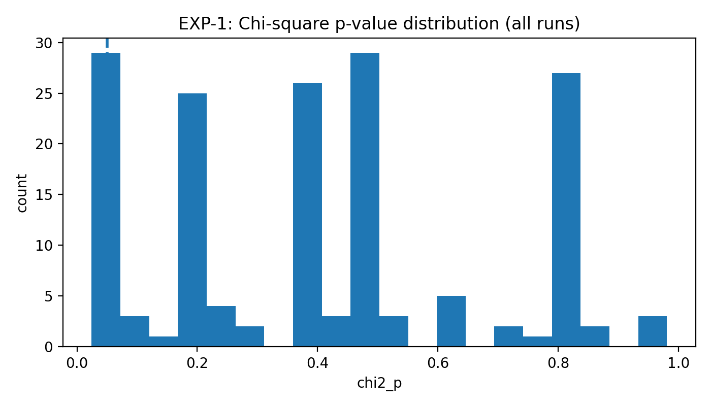
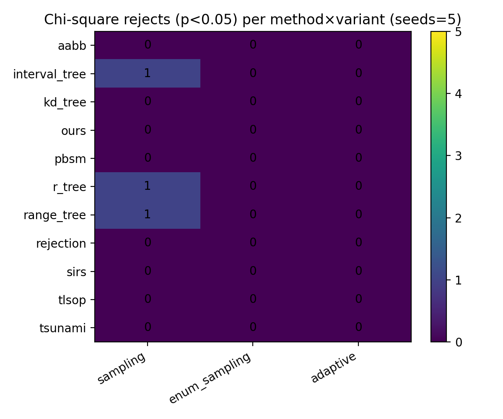
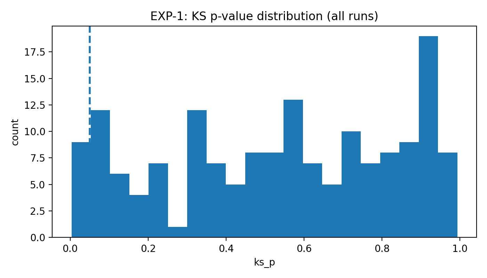
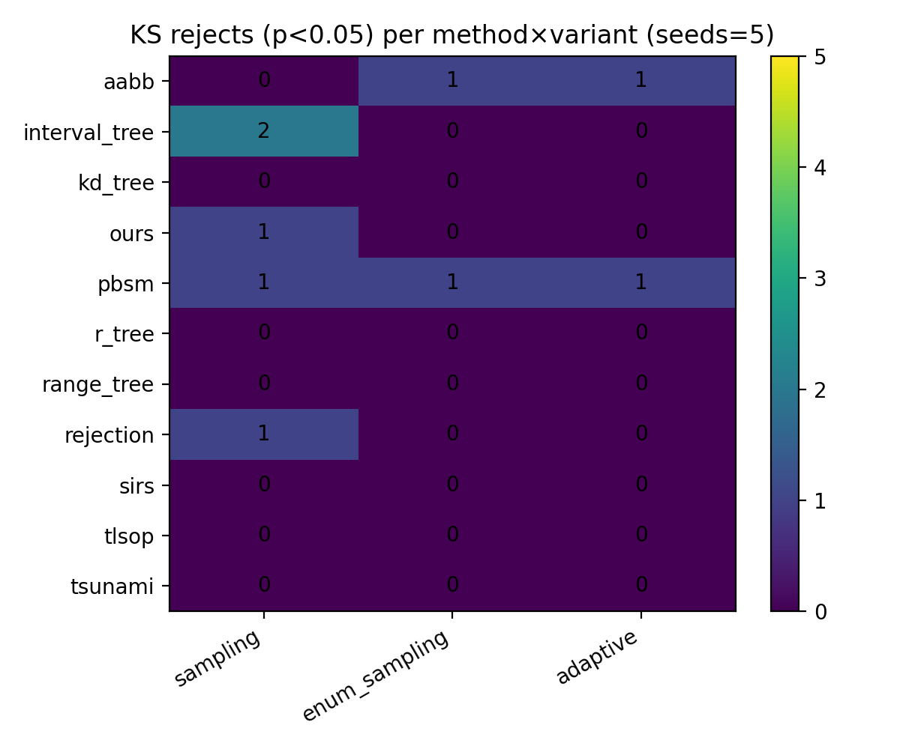
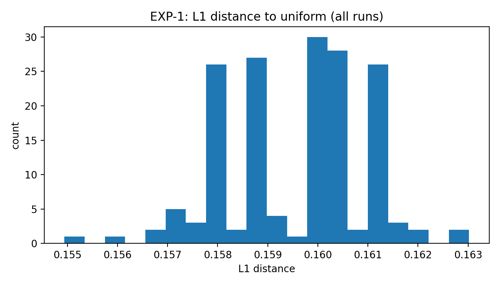
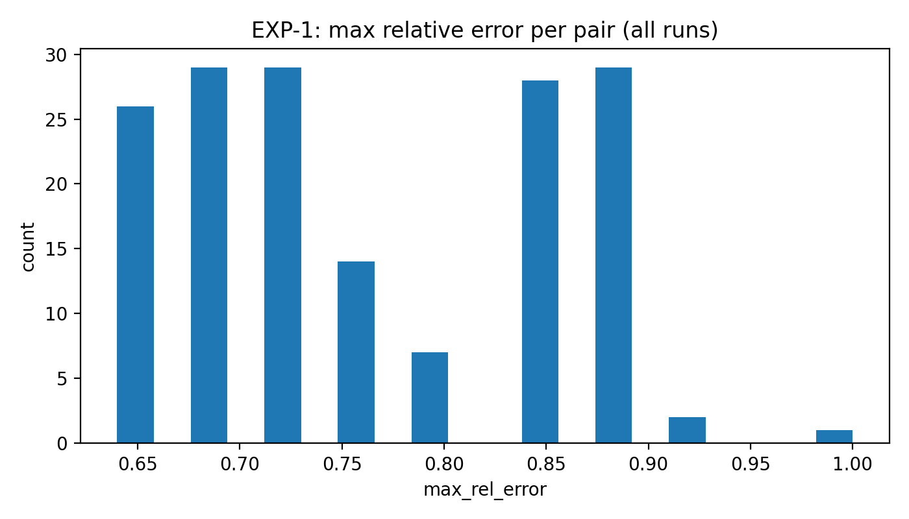
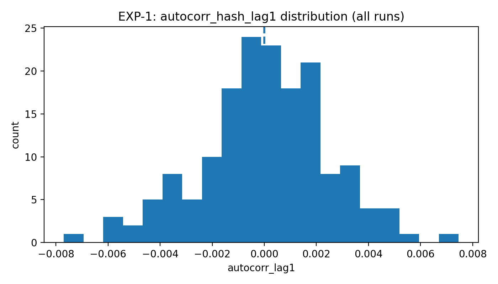

# EXP-1 实验报告：Correctness & Sample Quality（RQ1）

> 生成时间：2025-12-29 16:02 UTC  
> 本报告基于你提供的 **EXP-1 实验大纲**、**执行脚本 run_exp1.sh**、**日志解析脚本**，以及实际运行产物（`exp1_result.zip`）自动整理而成。

---

## 1. 实验的设计

### 1.1 实验目标（RQ1）

EXP‑1 的目标是回答：在统一语义下，各方法是否真的输出 **对空间连接结果集 $J$ 的 i.i.d. 均匀（有放回）样本**。

本实验把“理想采样”的要求拆成三个可检验条件：

1. **Correctness（语义正确）**：每个输出样本 $(r,s)$ 必须属于真实 join 结果集 $J$（missing 必须为 0）。
2. **Uniformity（近似均匀）**：样本在 $J$ 上应近似均匀（以 χ² 检验为主证据，KS 为 sanity check）。
3. **Independence（近似独立）**：样本之间应近似独立（用 lag‑1 自相关作为 sanity check）。

### 1.2 任务定义与统一语义

- 数据：两张关系 $R, S$，每条记录是 **2D 轴对齐矩形（AABB）**。
- 统一语义：**half‑open**（半开区间），边界贴合不算相交：
  $$
  r=[L_x(r),R_x(r))\times[L_y(r),R_y(r)),\quad
  s=[L_x(s),R_x(s))\times[L_y(s),R_y(s)).
  $$
- 空间连接结果集：
  $$
  J=\{(r,s)\mid r\in R,\ s\in S,\ r\cap s\neq\emptyset\}.
  $$

### 1.3 被评测的方法与运行模式

**方法集合（methods, Dim=2 build）：**

aabb, interval_tree, kd_tree, ours, pbsm, r_tree, range_tree, rejection, sirs, tlsop, tsunami

**三种统一运行模式（variants）：**

- `sampling`：不物化全部 $J$，直接输出 $t$ 个样本  
- `enum_sampling`：先枚举全部 $J$，再在枚举结果上均匀有放回抽样  
- `adaptive`：当 $J$ 小时走枚举，否则走采样（阈值/探测决定分支）

**重复与随机性：**

- seeds：1, 2, 3, 4, 5（共 5 次重复）

### 1.4 数据与参数设置（以执行脚本为准）

本次 EXP‑1 使用合成数据（synthetic）中的 **stripe** 生成器，并通过密度参数控制 join 大小。

关键参数（摘自 `data/MANIFEST.txt` 与运行结果）：

- 数据：`dataset_label=exp1_stripe_nr2000_ns2000_a1_g1`
- $|R| = n_r = 2000$
- $|S| = n_s = 2000$
- $\alpha = 1   # alpha=|J|/(n_r+n_s)$
- 抽样数：$t = 100000$（每次 run 输出样本数）
- repeats：5（即 seed0..seed0+repeats-1）
- Oracle 预算：max_checks=50000000, collect_limit=1000000

> 本实验刻意选用“小规模”（这里 $2000\times2000$）以便 **oracle 能完整枚举并收集 join universe**，从而做严格 correctness 与均匀性检验。

### 1.5 执行流程（从 0 到结果表）

执行脚本的流程可概括为：

1. **cmake 配置 + Release 编译**（可选 ctest）。
2. 对每个 `method × variant` 启动 `sjs_verify`：
   - 每次调用内部会做 `repeats=5` 个 run（seed=1..5）。
   - 先构建 oracle universe（完整的 $J$），再运行对应方法生成样本并做质量评估。
3. 将每个组合的日志写入 `data/logs/<method>__<variant>.log`。
4. 解析日志生成两张表：
   - `data/exp1_quality_raw.csv`（逐 run）
   - `data/exp1_quality_summary.csv`（按 method×variant 聚合的 median 摘要）

本报告的图表全部由这些 CSV 与日志自动生成。

---

## 2. 实验的结果

> 数据与日志都已随报告打包：  
> - 结果表：[`data/exp1_quality_summary.csv`](data/exp1_quality_summary.csv)、[`data/exp1_quality_raw.csv`](data/exp1_quality_raw.csv)  
> - 运行凭证：[`data/MANIFEST.txt`](data/MANIFEST.txt)  
> - 逐组合日志：[`data/logs/`](data/logs/)

### 2.1 执行概览

- 总 runs：**165**（11 methods × 3 variants × 5 seeds）
- Oracle join size（median）：**|J| = 4000**
- 每次 run 样本数：**t = 100000**
- 运行状态：全部为 OK（没有 FAILED / QUALITY_SKIPPED）

### 2.2 Correctness：missing_in_universe

**结论：所有 run 的 `missing_in_universe = 0`。**

这表示每个输出样本对 $(r,s)$ 都属于真实 join 结果集 $J$（语义完全对齐）。

### 2.3 Uniformity：χ²（主证据）与 KS（sanity check）

#### χ² 检验（p-value 分布）

- `chi2_p < 0.05`：**3/165 = 1.82%**
- 所有拒绝都发生在 `sampling`（非枚举）模式下，具体为：

- `interval_tree` / `sampling` / seed=5: chi2_p=0.0248
- `r_tree` / `sampling` / seed=2: chi2_p=0.0310
- `range_tree` / `sampling` / seed=1: chi2_p=0.0244

图：整体 p-value 分布如下（虚线为 0.05 阈值）：

以及按 method×variant 统计的拒绝次数（每格最多 5 次 seed）：

#### KS 检验（p-value 分布）

- `ks_p < 0.05`：**9/165 = 5.45%**

低于 0.05 的 run（共 9 个）如下：

- `rejection` / `sampling` / seed=5: ks_p=0.0034
- `aabb` / `adaptive` / seed=3: ks_p=0.0040
- `aabb` / `enum_sampling` / seed=3: ks_p=0.0040
- `ours` / `sampling` / seed=3: ks_p=0.0077
- `pbsm` / `adaptive` / seed=2: ks_p=0.0095
- `pbsm` / `enum_sampling` / seed=2: ks_p=0.0095
- `pbsm` / `sampling` / seed=2: ks_p=0.0095
- `interval_tree` / `sampling` / seed=1: ks_p=0.0200
- `interval_tree` / `sampling` / seed=4: ks_p=0.0265

图：整体 p-value 分布（虚线为 0.05 阈值）：

以及按 method×variant 的拒绝次数矩阵：

> 经验上，当我们做很多次统计检验（这里 165 次）时，即使完全均匀，也会出现少量 seed 被 0.05 阈值拒绝；因此主文更推荐报告“失败率 + 多重检验说明”，并以 χ² 作为主要证据。

#### 额外的分布误差指标（来自日志）

`sjs_verify` 的质量块还输出了多种直观误差度量（所有 165 runs 均可在日志中找到）：

- `unique_fraction` 恒为 **0.04**（因为 $|J|=4000$ 且 $t=100000$，几乎必然覆盖全部 4000 个 join pair，因此 unique_count≈4000，unique_count/t≈0.04）
- `l1`（到均匀分布的 L1 距离）：均值约 **0.1596**  
- `l_inf`（到均匀分布的 L∞ 距离）：均值约 **0.000190**  
- `max_rel_error`：均值约 **0.760**

图：L1 距离分布与最大相对误差分布（所有 runs）：

### 2.4 Independence：autocorr_hash_lag1（sanity check）

- `autocorr_lag1` 的 median：**0.000104**
- 最大绝对值：**0.007700**

图：自相关分布（虚线为 0）：

### 2.5 按 variant 汇总（median + 失败次数）

#### `sampling`（各方法的核心采样实现）

| method        |   chi2_p_median |   chi2_reject(p<0.05) |   ks_p_median |   ks_reject(p<0.05) |   autocorr_median |
|:--------------|----------------:|----------------------:|--------------:|--------------------:|------------------:|
| aabb          |          0.6019 |                     0 |        0.3091 |                   0 |            0.0017 |
| interval_tree |          0.1181 |                     1 |        0.3601 |                   2 |           -0.0015 |
| kd_tree       |          0.4994 |                     0 |        0.3472 |                   0 |           -0.0004 |
| ours          |          0.4609 |                     0 |        0.6412 |                   1 |            0.0007 |
| pbsm          |          0.402  |                     0 |        0.2307 |                   1 |            0.0006 |
| r_tree        |          0.2562 |                     1 |        0.3941 |                   0 |           -0.0004 |
| range_tree    |          0.4513 |                     1 |        0.5967 |                   0 |            0.0018 |
| rejection     |          0.5275 |                     0 |        0.5496 |                   1 |           -0.0034 |
| sirs          |          0.6311 |                     0 |        0.1799 |                   0 |           -0.0014 |
| tlsop         |          0.402  |                     0 |        0.6176 |                   0 |            0.0001 |
| tsunami       |          0.402  |                     0 |        0.9086 |                   0 |            0.001  |

> 表中 `chi2_reject(p<0.05)` / `ks_reject(p<0.05)` 的分母都是 5（5 个 seed）。

#### `enum_sampling` 与 `adaptive`

在本次 EXP‑1 设置下，**`adaptive` 与 `enum_sampling` 在所有方法上逐 seed 完全一致**（三项核心指标 χ²/KS/autocorr 的差值最大值均为 0），因此下表同时代表二者：

| method        |   chi2_p_median |   chi2_reject(p<0.05) |   ks_p_median |   ks_reject(p<0.05) |   autocorr_median |
|:--------------|----------------:|----------------------:|--------------:|--------------------:|------------------:|
| aabb          |           0.402 |                     0 |        0.4447 |                   1 |            0.0006 |
| interval_tree |           0.402 |                     0 |        0.714  |                   0 |            0.0004 |
| kd_tree       |           0.402 |                     0 |        0.4722 |                   0 |           -0.0017 |
| ours          |           0.402 |                     0 |        0.8266 |                   0 |           -0.0006 |
| pbsm          |           0.402 |                     0 |        0.2307 |                   1 |            0.0006 |
| r_tree        |           0.402 |                     0 |        0.6945 |                   0 |            0.0031 |
| range_tree    |           0.402 |                     0 |        0.2081 |                   0 |            0.0003 |
| rejection     |           0.402 |                     0 |        0.461  |                   0 |           -0.0005 |
| sirs          |           0.402 |                     0 |        0.759  |                   0 |           -0      |
| tlsop         |           0.402 |                     0 |        0.6176 |                   0 |            0.0001 |
| tsunami       |           0.402 |                     0 |        0.9086 |                   0 |            0.001  |

### 2.6 Count（补充）：rejection 的估计误差

除 `rejection / sampling` 外，其余方法的 `count` 均为 exact 且等于 oracle。

`rejection / sampling` 的 5 次重复中，`count` 为估计值（est），相对误差在 ±2.6% 内：

- seed=1: count=4095.4, oracle=4000, rel_err=2.39%
- seed=2: count=3898.0, oracle=4000, rel_err=-2.55%
- seed=3: count=4026.9, oracle=4000, rel_err=0.67%
- seed=4: count=3972.1, oracle=4000, rel_err=-0.70%
- seed=5: count=4095.4, oracle=4000, rel_err=2.39%

---

## 3. 对实验及其结果的分析

### 3.1 总体结论：结果非常理想

从 EXP‑1 的“硬门槛→主证据→sanity”三层证据来看：

- **Correctness**：missing 全为 0（硬门槛通过）。
- **Uniformity**：χ² 的拒绝率仅 **1.82%**（显著低于 5% 的直觉基线），且拒绝点分散、不呈系统性。
- **Independence**：lag‑1 自相关整体非常接近 0（sanity 支撑 i.i.d. 假设）。

因此，这组结果与 EXP‑1 的预期高度一致，可作为后续性能实验（runtime/scalability/adaptivity）可信度的“地基”。

### 3.2 为什么 `adaptive` 与 `enum_sampling` 会完全一致？

这并不反常，反而符合 EXP‑1 的设计初衷：

- EXP‑1 选小规模数据，oracle 可完整收集 $J$；
- 在这种设置下，大多数 adaptive 策略会判定 join 规模“小”，从而走“枚举/两遍采样”路径；
- 因此 `adaptive` 与 `enum_sampling` 在质量指标上呈现完全一致（本次运行中差值为 0）。

> 这也意味着：EXP‑1 真正检验“各方法自身采样机制差异”的主要舞台是 `sampling` variant。

### 3.3 如何解读少量 KS/χ² 拒绝点？

- **多重检验不可避免**：165 次检验在 0.05 阈值下出现少量拒绝是正常现象。
- **χ² 是主证据**：EXP‑1 的 χ² 使用 df=3999（即对 4000 个 join pair 的精确分类），在此设置下更有解释力。
- **KS 是 sanity check**：它基于 hash 映射后的一维连续检验，容易受到 hash 映射、离散支撑、多重检验影响；因此更适合用作补充证据而非一票否决。

如果要把结果写进论文，最稳健的呈现方式是：

- 主文报告：`missing=0`、`chi2_p_median`（跨 seed median）、以及 `chi2_p < 0.05` 的失败率；
- KS 与自相关放在同表或附录中作为 sanity 支撑，并在表注中说明多重检验。

### 3.4 下一步建议（让 EXP‑1 更“审稿人友好”）

1. 在主文表格里增加一列：`fail_rate(chi2_p<0.05)` 与 `fail_rate(ks_p<0.05)`。
2. 在表注明确：  
   - half‑open 语义；  
   - i.i.d. uniform with replacement；  
   - seed 重复次数与汇总口径（median）。
3. 若担心 KS 偶发拒绝被误读，可在附录补充：  
   - 调整 hash bucket 或采用分桶 χ² 的鲁棒性版本（当 |J| 更大时尤其需要）。

---

## 附录：复现入口

- 实验大纲（原文）：[`spec/EXP-1.md`](spec/EXP-1.md)
- 执行脚本（以此为准）：[`spec/run_exp1.sh`](spec/run_exp1.sh)
- 日志解析脚本（独立版）：[`spec/exp1_parse_verify_logs.py`](spec/exp1_parse_verify_logs.py)

