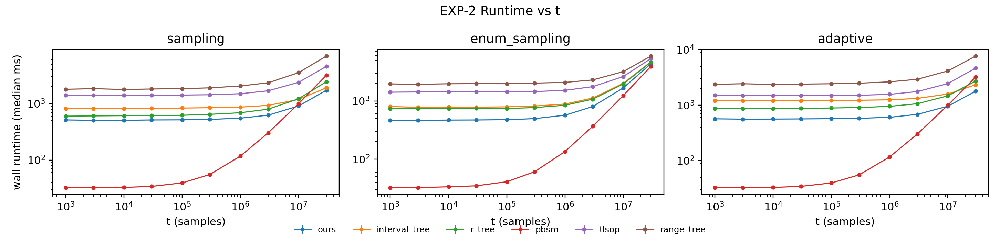
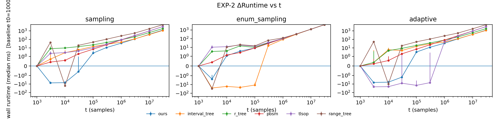
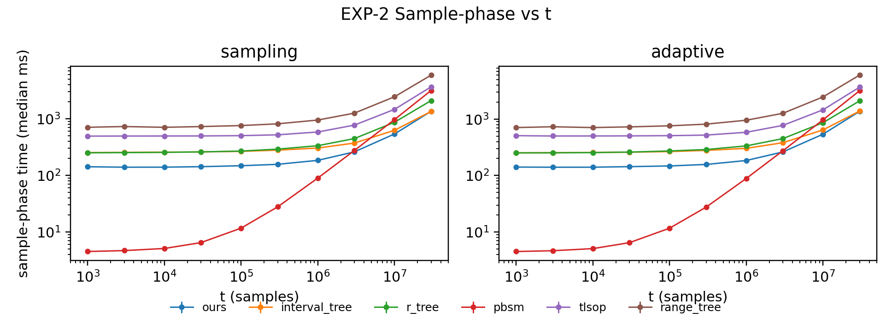

# EXP-2 实验报告：Runtime vs t（RQ2）

> **生成时间**：20251228_165357  
> **本报告基于你提供的 4 份材料整合而成**：  
> 1) 实验大纲：`appendix/EXP-2.md`  
> 2) 实际执行脚本（以它为准）：`appendix/run_exp2.sh`  
> 3) 绘图脚本：`appendix/exp2_plot.py`  
> 4) 本次运行的输出（包含图片与数据）：`artifacts/exp2_result_raw/`（来自 `exp2_result.zip`）

---

## 目录

- [1. 实验的设计](#1-实验的设计)
- [2. 实验的结果](#2-实验的结果)
- [3. 对实验及其结果的分析](#3-对实验及其结果的分析)
- [附录：可追溯性材料](#附录可追溯性材料)

---

## 1. 实验的设计

### 1.1 实验目标（RQ2）

EXP-2 旨在回答：

> 在 **固定数据集** 与 **固定密度参数 α** 下，仅改变采样数量 t（从 1k 扩展到 30M），各方法端到端 wall-clock 时间如何随 t 增长？  
> 这用来刻画“多抽样本”的扩展性，并区分不同范式（Sampling / Enum+Sampling / Adaptive）的增长形态。

### 1.2 任务定义（Join + Sampling）

- 输入：两张关系表 R,S，每条记录是一个二维轴对齐矩形盒（half-open 语义）：

  r = [Lx(r), Rx(r)) × [Ly(r), Ry(r))  
  s = [Lx(s), Rx(s)) × [Ly(s), Ry(s))

- Join 输出：

  J = {(r,s) | r∈R, s∈S, r 与 s 相交}

- 目标：从 J 中生成 **t 个 i.i.d.、均匀、有放回** 的样本对。

> **half-open（边界贴合不算相交）** 是比较公平性的基础：任意 baseline 若边界条件用错（`<=` / `<`），会导致 |J| 不一致，从而使 runtime vs t 的对比失真。

### 1.3 数据集与固定参数（本次运行实际用的）

本次运行使用 synthetic 数据集（见 `data/sweep_used.json`）：

- Dataset：`stripe_t`  
- Generator：`stripe_ctrl_alpha`
- 维度：2D
- n_R=100,000，n_S=100,000
- α=1
- Seed：1

Generator 的关键参数（用于理解数据结构特性）：

- control_axis = 1  
- core 区间：[0.45, 0.55]  
- gap_factor = 0.1, delta_factor = 0.25  
- shuffle_strips=True, shuffle_r=False, swap_sides=False

**Join 规模 sanity（固定数据集应与 t 无关）：**

- 在所有 `exact_frac=1` 且 `ok_rate=1` 的点上，`count_mean` 恒为：|J| = 200,000（见 `data/sweep_summary.csv`）。  
- 这与 EXP-2 的“固定数据集、只扫 t”设计完全一致。

### 1.4 Sweep 变量：仅 sweep t（本次为 full profile）

本次执行选择了 `--t_profile full`，实际 sweep 的 t-list 为（见 `MANIFEST.txt` 与 `sweep_used.json`）：

t ∈ [1,000, 3,000, 10,000, 30,000, 100,000, 300,000, 1,000,000, 3,000,000, 10,000,000, 30,000,000]

### 1.5 参评方法与运行模式（variant）

**方法（method）** 共 10 个：

`ours, aabb, interval_tree, kd_tree, r_tree, range_tree, pbsm, tlsop, sirs, rejection`

**运行模式（variant）** 共 3 种：

- `sampling`：直接采样  
- `enum_sampling`：先枚举 join 流，再按 rank 做均匀采样  
- `adaptive`：根据 pilot 与阈值选择枚举/采样分支

**Adaptive 阈值**：`j_star = 10000`（见 `sweep_used.json`）。

### 1.6 执行参数与统计口径（以脚本与 plotter 行为为准）

本次运行关键设置（见 `data/MANIFEST.txt` 与 `data/env.txt`）：

- 构建：Release
- 环境：Linux ta 5.4.0-216-generic #236-Ubuntu SMP Fri Apr 11 19:53:21 UTC 2025 x86_64 x86_64 x86_64 GNU/Linux
- 编译器：c++ (Ubuntu 9.4.0-1ubuntu1~20.04.2) 9.4.0
- CMake：4.2.0，jq：1.6
- Git commit：ebb23ac75a
- 线程数：1（并同步设置 `OMP_NUM_THREADS/MKL/...` 以避免外部库多线程干扰）
- `write_samples = False`（关闭写样本，避免 I/O 污染）
- repeats：总 6 次，其中 warmup=1（不参与画图/统计），有效 repeats=5
- 绘图：
  - Δruntime 基线：`t0 = 1000`
  - error bar：`auto` ⇒ 因有效 repeats=5，所以最终采用 **stdev**（见 `data/EXP2_README.txt`）
  - paper mode method 子集：top-k 自动选择 + `always_include=ours`，本次图中最终包含 6 个方法：
    `ours, interval_tree, r_tree, pbsm, tlsop, range_tree`

---

## 2. 实验的结果

> **本节强烈依赖**你上传的 `exp2_result.zip` 中的图片与数据。  
> - 原始数据：`data/sweep_raw.csv`（单次运行一行）  
> - 聚合结果：`data/sweep_summary.csv`（按 method×variant×t 聚合）  
> - 绘图产物：`figures/*.png`（来自 `full/exp2_paper_*.png`）  
> - sample-phase 斜率表：`data/exp2_ns_per_sample.csv`  
> - 自动派生结论：`data/EXP2_TAKEAWAYS.txt`

### 2.1 完整性与 sanity check

- plotter 使用的有效数据行数：**1450**（已剔除 warmup rep=0，见 `data/EXP2_README.txt`）
- 被剔除的点数（min_repeats 不足）：**0**（说明所有点均有 ≥5 次有效重复）
- `ok_rate`：除 `rejection + sampling` 被显式 skip 外，其余所有 method×variant×t 点均 `ok_rate=1`  
  - `rejection + sampling` 在 summary 里标注为：`SKIPPED: rejection+sampling is disabled ...`（见 `data/sweep_summary.csv`）

### 2.2 主图 1：端到端 Runtime vs t

图说明：

- 横轴：t（log）
- 纵轴：wall runtime（median ms，log）
- 三个面板：`sampling` / `enum_sampling` / `adaptive`
- error bar：本次为 **stdev（上界）**

### 2.3 主图 2：ΔRuntime vs t（以 t0=1000 为基线）

图说明：

- Δruntime 不是 “median(t)-median(t0)” 的简单差，而是 plotter 对 **同一 rep 做 baseline 对齐** 后再聚合（减少系统噪声）。
- y 轴是 symlog，因此会看到少量 “负 Δ”（通常来自缓存/抖动导致某些 rep 在更大 t 上反而略快，属正常现象）。

### 2.4 主图 3：Sample-phase vs t（抓取 phases_json 中的 sample 阶段）

图说明：

- 仅展示 `sampling` 与 `adaptive`（该图是从 `phases_json` 里鲁棒提取 sample 阶段计时得到的）
- 用来更直接估计 “每多生成 1 个样本需要多少时间”

### 2.5 关键数值摘要（来自 raw，剔除 warmup 后聚合）

#### (A) Sampling 模式：端到端 runtime（median ± stdev）

| 方法          | t=1,000 median±stdev (ms)   | t=1,000,000 median±stdev (ms)   | t=10,000,000 median±stdev (ms)   | t=30,000,000 median±stdev (ms)   |
|:--------------|:----------------------------|:--------------------------------|:---------------------------------|:---------------------------------|
| ours          | 514.635 ± 1.996             | 551.894 ± 1.910                 | 909.225 ± 2.715                  | 1,726.3 ± 5.176                  |
| pbsm          | 32.095 ± 0.135              | 117.215 ± 0.697                 | 995.888 ± 7.127                  | 3,189.0 ± 12.541                 |
| interval_tree | 819.552 ± 2.393             | 867.259 ± 2.173                 | 1,187.7 ± 3.139                  | 1,914.0 ± 4.380                  |
| r_tree        | 601.044 ± 3.540             | 691.019 ± 1.296                 | 1,221.8 ± 1.398                  | 2,449.1 ± 2.719                  |
| tlsop         | 1,411.5 ± 1.013             | 1,502.8 ± 2.497                 | 2,390.3 ± 9.686                  | 4,588.3 ± 12.572                 |
| range_tree    | 1,803.1 ± 1.614             | 2,059.4 ± 1.972                 | 3,549.0 ± 17.697                 | 6,981.9 ± 33.961                 |

> 读法建议：  
> - **t=1k** 主要反映固定开销（build/index/count 等）  
> - **t=30M** 更接近渐近斜率（每个 sample 的摊还成本）

#### (B) Sample-phase 的斜率（ns/sample）

来自 `data/exp2_ns_per_sample.csv`（对 sample-phase median 进行回归估计）：

| 方法          |   sampling ns/sample (reg) |   sampling ns/sample (tail3) |   adaptive ns/sample (reg) |   adaptive ns/sample (tail3) |
|:--------------|---------------------------:|-----------------------------:|---------------------------:|-----------------------------:|
| ours          |                       40.4 |                         40.6 |                       40.8 |                         41.1 |
| pbsm          |                      104.8 |                        107.5 |                      105.2 |                        107.9 |
| interval_tree |                       36.3 |                         36.1 |                       37.5 |                         37.1 |
| r_tree        |                       61.1 |                         61.1 |                       61.1 |                         61.1 |
| tlsop         |                      105.3 |                        107.7 |                      105.1 |                        107.9 |
| range_tree    |                      172.1 |                        172.1 |                      175.4 |                        175.8 |

并且 takeaways 文件自动计算了关键比值（见 `data/EXP2_TAKEAWAYS.txt`）：

- sampling：pbsm / ours ≈ **2.595×**（pbsm 的 ns/sample 更大，扩展性更差）
- adaptive：结论一致（因为本次 adaptive 全走 sampling 分支，见下节）

#### (C) Adaptive 分支选择（为什么 adaptive≈sampling）

本次数据集 join size |J|=200,000 明显大于 `j_star=10,000`。raw 数据也显示：

- **所有方法在 adaptive 下均选择 `fallback_sampling`**
- pilot_pairs 恒为 **10001**（即 `j_star + 1`），并且 `used_enumeration=0`

（摘自 `data/sweep_raw.csv` 的聚合）

| method        | adaptive_branch   |   pilot_pairs |   used_enumeration |
|:--------------|:------------------|--------------:|-------------------:|
| aabb          | fallback_sampling |         10001 |                  0 |
| interval_tree | fallback_sampling |         10001 |                  0 |
| kd_tree       | fallback_sampling |         10001 |                  0 |
| ours          | fallback_sampling |         10001 |                  0 |
| pbsm          | fallback_sampling |         10001 |                  0 |
| r_tree        | fallback_sampling |         10001 |                  0 |
| range_tree    | fallback_sampling |         10001 |                  0 |
| rejection     | fallback_sampling |         10001 |                  0 |
| sirs          | fallback_sampling |         10001 |                  0 |
| tlsop         | fallback_sampling |         10001 |                  0 |

#### (D) 一个重要的“crossover”现象（ours vs pbsm）

以 `sampling` 的 warmup-filtered median wall time 为准（见 `data/sweep_raw.csv` 聚合）：

- t=1,000,000：ours ≈ 551.9 ms，pbsm ≈ 117.2 ms（pbsm 更快）
- t=10,000,000：ours ≈ 909.2 ms，pbsm ≈ 995.9 ms（开始接近/反超）
- 在 1e6 到 1e7 之间做线性插值，估计 crossover 点约为：

  t_cross ≈ 8,503,924（约 8–9 million）

> 解释：ours 的固定成本更高，但 sample-phase 的 ns/sample 更低；pbsm 固定成本很小，但随 t 增长更快。因此“谁更快”取决于 t 的规模。

---

## 3. 对实验及其结果的分析

### 3.1 与 EXP-2 预期是否一致？

整体上 **一致**：

- `sampling` 与 `adaptive` 在大 t 区间呈现近线性增长趋势（更准确地说：在 log 坐标下斜率稳定），符合“必须生成 t 个样本”的必然代价。
- `enum_sampling` 在大 t 区间出现更明显的增长（常见原因：rank 生成 + 排序带来 t·log t 项，且枚举扫描成本叠加）。
- `adaptive` 的行为可解释且可验证：本次 |J| >> j_star，因此始终走 `fallback_sampling`，表现应接近 sampling（raw 也证实了这一点）。

### 3.2 读图要点：为什么建议同时看 Runtime 与 ΔRuntime？

- **Runtime vs t**：展示绝对开销（更贴近“用户到底要等多久”）。
- **ΔRuntime vs t**：更强调“随着 t 增长的额外成本”，对比每种方法的 **斜率/扩展性**更直观。
- 本次 Δ 图中出现的少量负值，主要来自 rep 级噪声（缓存/系统抖动），且 plotter 采用“同 rep baseline”已显著压制这类噪声，这属于正常现象。

### 3.3 关键结论：ours 的优势更偏“扩展性”，pbsm 的优势更偏“小 t”

从表格与 `exp2_ns_per_sample.csv` 可以看到一个很清晰的 trade-off：

- **pbsm**
  - t=1k 时极快（~32ms），固定开销很小；
  - 但 sample-phase 斜率约 105 ns/sample，随着 t 增长更快。
- **ours**
  - t=1k 时固定开销明显更大（~515ms）；
  - 但 sample-phase 斜率约 40 ns/sample，随 t 增长更慢；
  - 因此在 t ≳ 10^7 的区间出现对 pbsm 的反超。

> 写论文时建议避免“单句绝对化结论（ours 始终更快）”，而改成更稳健的表述：  
> **ours 在大 t 具有更优的每样本成本（ns/sample），适合需要大量样本的场景；pbsm 在小 t 更具优势。**

### 3.4 其他 baseline 的信号（从图上能读到什么）

在本次数据集上（尤其看 sampling@30M）：

- `interval_tree`：斜率很优（~36 ns/sample），但固定成本较大（~820ms），因此整体第二快。
- `r_tree`：中等斜率（~61 ns/sample）+ 中等固定成本（~600ms），属于“稳健但不极致”的选择。
- `tlsop` 与 `range_tree`：固定成本与斜率都偏大，在大 t 下被明显甩开。

### 3.5 潜在威胁与改进建议（为了让结果更“paper-ready”）

1) **本次是 full profile：有效 repeats=5**  
   - plotter 因此用的是 **stdev** 而非 p95。  
   - 若要作为主文最终图，更建议按脚本跑 `--t_profile paper`（有效 repeats=10）并报告 p95，更容易说服审稿人。

2) **需要解释“大 t 是否合理”**  
   - 本次 ours 的优势主要在 t ≥ 10^7 后才完全释放。  
   - 如果论文场景只需要 t ≤ 10^6，读者会认为 pbsm 更占优。  
   - 建议在论文里明确：为什么需要千万级样本（例如：估计方差需要、下游学习/置信区间要求、或多 query/多批次累计样本等）。

3) **rejection+sampling 被 skip**  
   - 这不会影响主结论，但如果论文/附录要讨论 rejection baseline，需要写明 “未启用/原因”。

---

## 附录：可追溯性材料

- 实验大纲（文字说明）：`appendix/EXP-2.md`
- 执行脚本（真实运行逻辑）：`appendix/run_exp2.sh`
- 绘图脚本（统计/过滤/误差条/方法选择）：`appendix/exp2_plot.py`

- 关键产物（来自运行输出）：
  - `data/sweep_raw.csv`：每个 (method,variant,t,rep) 一行（已包含 `adaptive_branch` 等字段）
  - `data/sweep_summary.csv`：聚合表
  - `data/exp2_ns_per_sample.csv`：sample-phase 回归斜率（ns/sample）
  - `data/MANIFEST.txt`：本次 profile 运行参数
  - `data/env.txt`：环境信息（OS / compiler / cmake / commit）
  - `figures/exp2_paper_*.png`：报告中引用的主图

如需完整保留原始目录结构，请查看：`artifacts/exp2_result_raw/`。
