# EXP‑3 实验报告：Runtime vs 密度参数 α（RQ3）

> 本报告由你提供的 EXP‑3 运行产物（CSV + 图）自动生成，**以执行脚本实际跑出来的结果为准**。
> 关键输入：`sweep_summary.csv`、`sweep_raw.csv`、`derived/adaptive_branch_ratio.csv`，以及 `plots/main/*.png`。

## 1. 实验的设计

### 1.1 实验目标（RQ3）

- 研究问题：当空间连接（spatial range join）的**连接密度**变化时，各方法的**端到端采样时间**如何变化？
- 重点关注：
  - **稳定性**：是否对 α 不敏感（曲线平坦）？
  - **退化机制**：α 增大时哪些方法显著变慢？
  - **自适应换挡**：Adaptive 是否在合适的密度区间从枚举切换到采样？

### 1.2 任务定义与 α 的含义

- 数据：二维轴对齐矩形（AABB），采用 **half‑open** 语义：`[Lx, Rx) × [Ly, Ry)`，边界贴合不算相交。
- Join：`J = {(r,s) | r∈R, s∈S, r∩s ≠ ∅}`。
- 输出：从 `J` 上抽取 `t` 个 **i.i.d.、均匀、有放回**样本对 `(r,s)`。
- EXP‑3 的密度参数定义：
  - **α = |J| / (n_r + n_s)**
  - 直觉：每个对象的平均匹配量级（比 `|J|/(|R||S|)` 更适合跨规模/压力对齐）。

### 1.3 数据生成（synthetic，可控 join 大小）

- 生成器：`stripe_ctrl_alpha`（可控密度条带构造）。
- 规模：`n_r=100,000`，`n_s=100,000`。
- 通过控制 join 大小 `|J| ≈ α·(n_r+n_s)` 来实现 α 扫描（本次结果中 `count_value` 为 **exact**，并与 α 列表严格对齐）。

### 1.4 扫描变量与固定参数（以 effective config 为准）

**固定参数**（来自 `sweep_exp3_effective.json`）：

| item                    | value          |
|:------------------------|:---------------|
| n_r                     | 100,000        |
| n_s                     | 100,000        |
| t (samples)             | 100,000        |
| repeats                 | 3              |
| sys.threads             | 1              |
| J★ (adaptive threshold) | 1,000,000      |
| enum_cap                | 0 (0=disabled) |

**扫描维度**：

| sweep   | values                                                                               |
|:--------|:-------------------------------------------------------------------------------------|
| alpha   | 0, 0.03, 0.1, 0.3, 1, 3, 4, 5, 6, 10, 30, 100, 300                                   |
| method  | ours, aabb, interval_tree, kd_tree, r_tree, range_tree, pbsm, tlsop, sirs, rejection |
| variant | sampling, adaptive                                                                   |

> 理论换挡点：α★ ≈ J★/(n_r+n_s) = 1,000,000/200,000 = **5**。

### 1.5 执行流程（与 `run/run_exp3.sh` 一致）

本次 EXP‑3 的实际执行流水线可以概括为：
1) 编译（Release） → 2) 生成 **effective sweep config** → 3) 运行 `sjs_sweep` 扫描 α →
4) 从 `sweep_raw.csv` 导出 Adaptive 分支比例 → 5) 画图（symlog‑x + log‑y） → 6) 同步到结果目录。

关键输出文件：
- `data/sweep_summary.csv`：聚合后的结果（画主图使用）。
- `data/sweep_raw.csv`：逐次重复的原始记录（用于解释/导出分支比例）。
- `data/derived/adaptive_branch_ratio.csv`：Adaptive 在不同 α 下走枚举/回退采样的比例。
- `figures/*.png`：画图脚本生成的图。

### 1.6 计时与成功率口径

- 主指标：`wall_median_ms`（端到端 wall time 的 median），并记录 `wall_p95_ms`。
- `ok_rate`：该点位成功完成的比例（`repeats=3` 时，1 表示 3 次都成功）。
- 画图规则（与脚本一致）：若 `ok_rate==0` 或 `wall_median_ms<=0` 则跳过该点（避免 log‑y 崩溃），并写入 `plots_main_plot_skipped_points.csv`。

## 2. 实验的结果

### 2.1 结果包结构（本报告已一并打包）

- **图像**：`figures/`（来自原始结果包 `plots/main/`）
- **数据**：`data/`（`sweep_summary.csv`, `sweep_raw.csv`, `derived/adaptive_branch_ratio.csv`）
- **配置与环境**：`config/manifest.txt`, `config/sweep_exp3_effective.json`

### 2.2 主结果图：所有方法（Sampling）的 runtime vs α

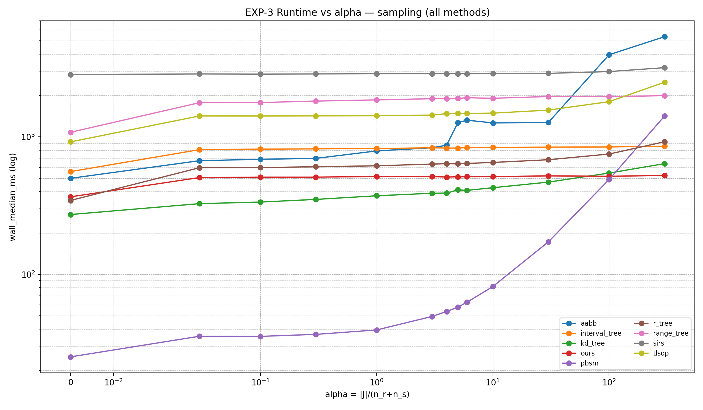

**读图提示**：x 轴为 symlog（因为包含 α=0），y 轴为 log（wall time）。该图只叠加 `variant=sampling`，便于观察纯采样模式下对密度的敏感性。

### 2.3 Ours：Sampling vs Adaptive（重点方法）

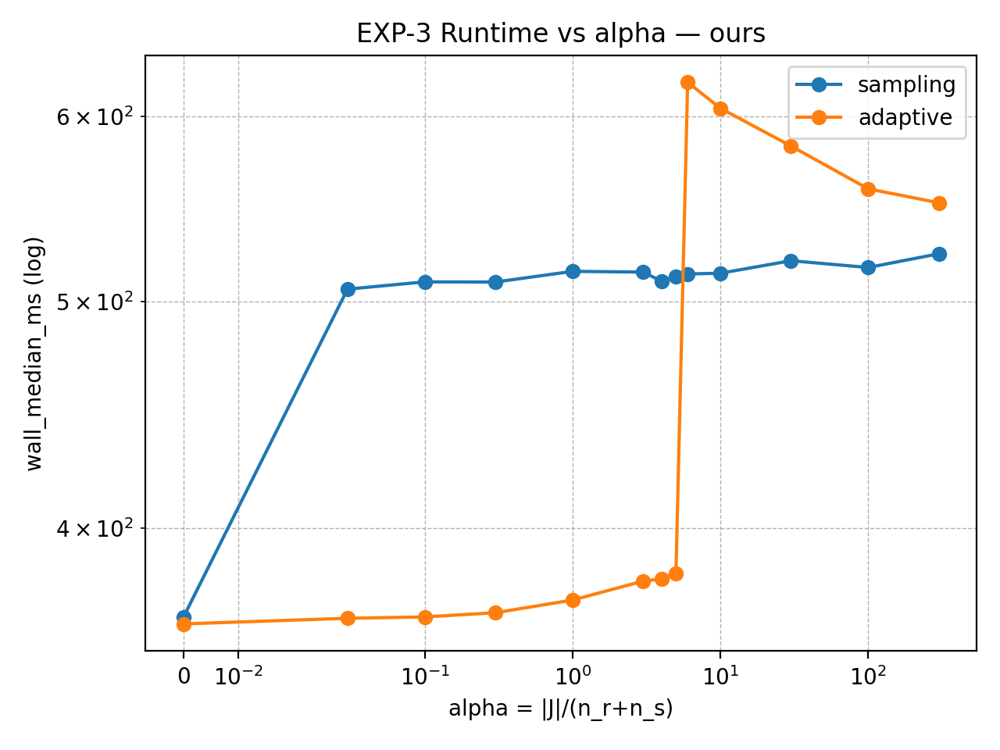

- `sampling` 曲线基本平坦（对 α 极不敏感）。
- `adaptive` 在 α≤5 走枚举分支，α≥6 回退采样；在 α=6 附近出现峰值（见第 3 节解释）。

### 2.4 Adaptive 换挡证据：枚举分支比例 vs α

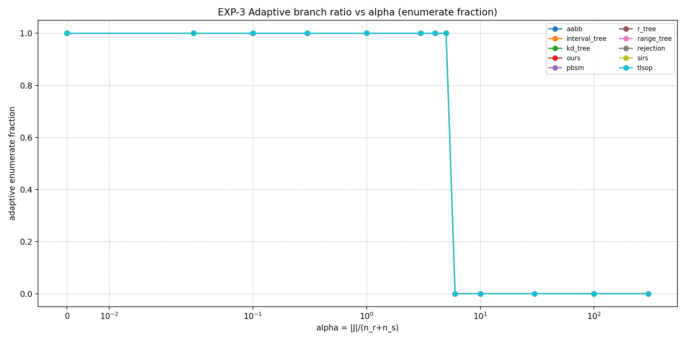

从导出的 `enumerate_frac` 可以直接验证：
- α≤5：`enumerate_frac = 1.0`
- α≥6：`enumerate_frac = 0.0`
与理论换挡点 α★≈5 完全一致。

### 2.5 Rejection 的特殊说明（sampling 被跳过）

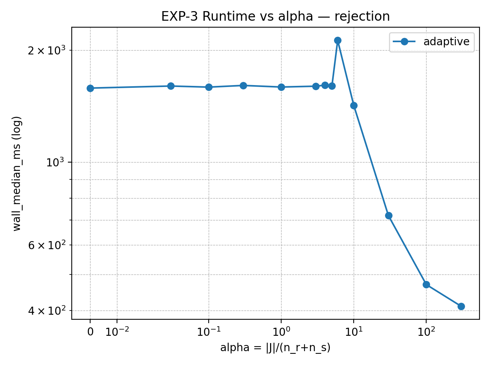

- 本次结果中，`rejection + sampling` 在所有 α 上 `ok_rate=0`（被实现禁用/跳过或不适用），因此不会出现在 log‑y 图上。
- 画图脚本将这些点记录在：`data/plots_main_plot_skipped_points.csv`。
- `rejection + adaptive` 随 α 增大呈现明显下降（高密度下 acceptance 变高是合理解释之一，详见第 3 节）。

### 2.6 关键数表（来自 sweep_summary.csv）

#### 表 1：Sampling 变体在代表性 α 下的 wall time（median, ms）

| method        | alpha=0.1   | alpha=5   | alpha=300   |
|:--------------|:------------|:----------|:------------|
| aabb          | 687.1       | 1270      | 5355        |
| interval_tree | 814.5       | 828.9     | 854.4       |
| kd_tree       | 335.6       | 411.4     | 639.0       |
| ours          | 509.7       | 512.5     | 524.0       |
| pbsm          | 35.39       | 57.75     | 1416        |
| r_tree        | 598.0       | 636.7     | 921.2       |
| range_tree    | 1776        | 1906      | 1995        |
| rejection     | N/A         | N/A       | N/A         |
| sirs          | 2863        | 2878      | 3188        |
| tlsop         | 1418        | 1486      | 2498        |

> 说明：`rejection + sampling` 为 N/A（该组合在本次运行中 `ok_rate=0`）。

#### 表 2：Adaptive 变体在代表性 α 下的 wall time（median, ms）

| method        |   alpha=0.1 |   alpha=5 |   alpha=300 |
|:--------------|------------:|----------:|------------:|
| aabb          |      638    |   1039    |      5564   |
| interval_tree |      723.2  |    730.7  |      1079   |
| kd_tree       |      461.8  |    504.3  |       951.3 |
| ours          |      366.5  |    382.5  |       551   |
| pbsm          |       25.79 |     38.51 |      1451   |
| r_tree        |      415.7  |    440.7  |      1058   |
| range_tree    |     1273    |   1339    |      2386   |
| rejection     |     1590    |   1602    |       410.7 |
| sirs          |     3478    |   3471    |      3203   |
| tlsop         |      916.8  |    932.2  |      2567   |

#### 表 3：Adaptive 换挡阈值（从 derived/adaptive_branch_ratio.csv 统计）

| method        |   max_alpha_enumerate |   min_alpha_fallback |
|:--------------|----------------------:|---------------------:|
| aabb          |                     5 |                    6 |
| interval_tree |                     5 |                    6 |
| kd_tree       |                     5 |                    6 |
| ours          |                     5 |                    6 |
| pbsm          |                     5 |                    6 |
| r_tree        |                     5 |                    6 |
| range_tree    |                     5 |                    6 |
| rejection     |                     5 |                    6 |
| sirs          |                     5 |                    6 |
| tlsop         |                     5 |                    6 |

#### 表 4：Ours(Adaptive) 的 pilot/分支与时间（按 α 汇总）

|   alpha | branch            | pilot_pairs_median   |   used_enumeration_frac |   wall_median_ms |
|--------:|:------------------|:---------------------|------------------------:|-----------------:|
|    0    | enumerate_all     | 0                    |                       1 |            364   |
|    0.03 | enumerate_all     | 6,000                |                       1 |            366.1 |
|    0.1  | enumerate_all     | 20,000               |                       1 |            366.5 |
|    0.3  | enumerate_all     | 60,000               |                       1 |            368.1 |
|    1    | enumerate_all     | 200,000              |                       1 |            372.7 |
|    3    | enumerate_all     | 600,000              |                       1 |            379.7 |
|    4    | enumerate_all     | 800,000              |                       1 |            380.5 |
|    5    | enumerate_all     | 1,000,000            |                       1 |            382.5 |
|    6    | fallback_sampling | 1,000,001            |                       0 |            620.3 |
|   10    | fallback_sampling | 1,000,001            |                       0 |            604.7 |
|   30    | fallback_sampling | 1,000,001            |                       0 |            582.6 |
|  100    | fallback_sampling | 1,000,001            |                       0 |            558.6 |
|  300    | fallback_sampling | 1,000,001            |                       0 |            551   |

## 3. 对实验及其结果的分析

### 3.1 换挡行为是否符合预期？——✅高度一致

- 本次设置 `J★=1,000,000`，`n_r+n_s=200,000`，因此理论换挡点 **α★≈5**。
- 实测 `enumerate_frac` 在 **α=5 与 α=6 之间发生“阶跃”**，且所有方法一致（表 3 与图 2.4）。
- 同时 `sweep_raw.csv` 中 `adaptive_pilot_pairs` 在 fallback 区间稳定为 **J★+1**（例如 Ours 表 4 中为 1,000,001），说明判定逻辑确实按阈值工作。

### 3.2 纯 Sampling 模式下，各方法对密度 α 的敏感性

下面用一个简单指标衡量“密度敏感性”：
- **growth = median_time(α=300) / median_time(α=0.1)**（Sampling 变体）。

| method        |   sampling_median_ms_alpha0.1 |   sampling_median_ms_alpha300 | growth_x   |
|:--------------|------------------------------:|------------------------------:|:-----------|
| pbsm          |                         35.39 |                        1416   | 40.02×     |
| aabb          |                        687.1  |                        5355   | 7.79×      |
| kd_tree       |                        335.6  |                         639   | 1.90×      |
| tlsop         |                       1418    |                        2498   | 1.76×      |
| r_tree        |                        598    |                         921.2 | 1.54×      |
| range_tree    |                       1776    |                        1995   | 1.12×      |
| sirs          |                       2863    |                        3188   | 1.11×      |
| interval_tree |                        814.5  |                         854.4 | 1.05×      |
| ours          |                        509.7  |                         524   | 1.03×      |

解读：
- **Ours**：growth≈1.03×（几乎完全平坦），说明对 α 极稳定。
- **IntervalTree**：growth≈1.05×（也相当稳定，但绝对耗时高于 Ours）。
- **AABB / PBSM**：随 α 增大退化显著（分别约 7.8× 与 40×），符合“密度压力下结构访问/候选膨胀”的直觉。

### 3.3 Adaptive 在 α=6 附近出现峰值的原因（如何写进论文）

- 在 α≤5：Adaptive 走 `enumerate_all`，直接物化/枚举 `|J|` 并从中采样；此时 `adaptive_pilot_pairs = |J|`（表 4）。
- 在 α≥6：Adaptive 走 `fallback_sampling`。
  - 典型实现会先进行 pilot：枚举到 **J★+1** 即停止（用来判定“|J| 是否超过阈值”）。
  - 然后丢弃已枚举部分，转入 Sampling 的两遍扫描/计数/采样流程。
- 因此在 **刚超过阈值** 的区域（例如 α=6，|J|=1,200,000），pilot 会做接近 1,000,001 次枚举，
  但仍需再做 Sampling 的流程 → 造成峰值是合理且可解释的。

写作建议：
- 在主文用 1–2 句话解释“pilot 截断带来的非单调性”。
- 若要更强说服力，可在附录补一张 phase breakdown（Build/Count/Sample/Pilot）随 α 的图。

### 3.4 Rejection(Adaptive) 随 α 增大变快：如何解释

- Rejection 类方法通常在“候选 superset 上均匀提议 + 相交判定接受/拒绝”。
- 在很多可控密度构造中，α 增大意味着“候选中真实相交比例更高”（接受率上升），
  因而**每得到一个样本所需的提议次数减少**，总时间可能下降。
- 本次结果里 `rejection + adaptive` 从 α=0.1 的 ~1590ms 降到 α=300 的 ~411ms（表 2），
  与该机制方向一致。

### 3.5 结论小结（面向论文的 3 句话版本）

1) EXP‑3 证明了：Adaptive 的换挡点与理论 α★=J★/(n_r+n_s) 高度一致，并可用分支比例图直接验证。
2) 在纯 Sampling 模式下，Ours 的 runtime 对 α 基本不敏感（α=0.1→300 仅约 1.03×）。
3) 在极端稠密区，部分 baseline 出现显著退化；而 Ours 仍保持稳定，且 Adaptive 只带来可解释的 pilot 开销。

---

## 附录 A：每个方法的 runtime vs α 图（plots/main）

### aabb

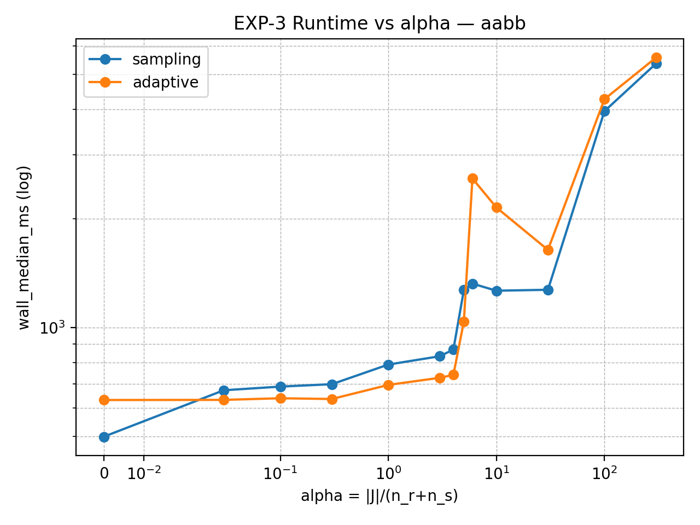

### interval_tree

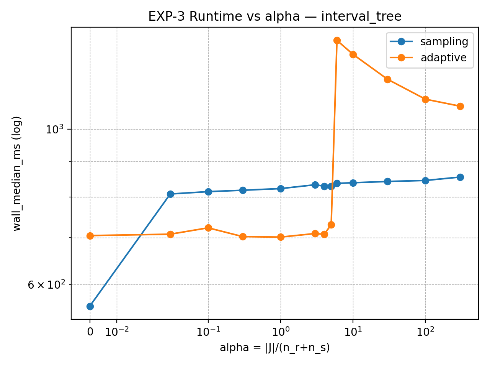

### kd_tree

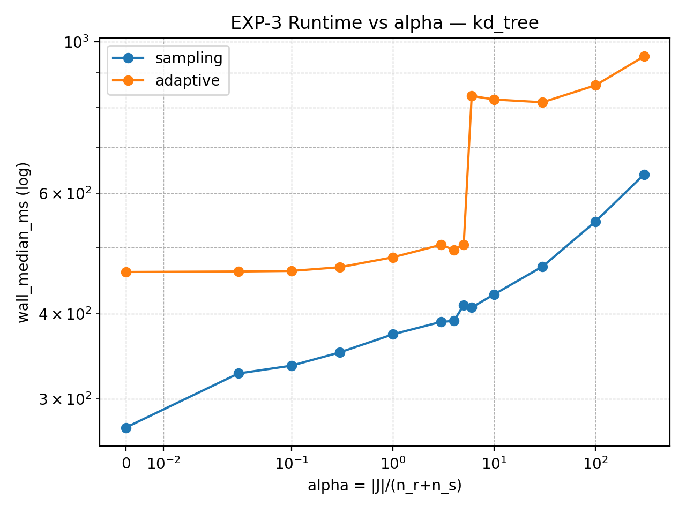

### ours

### pbsm

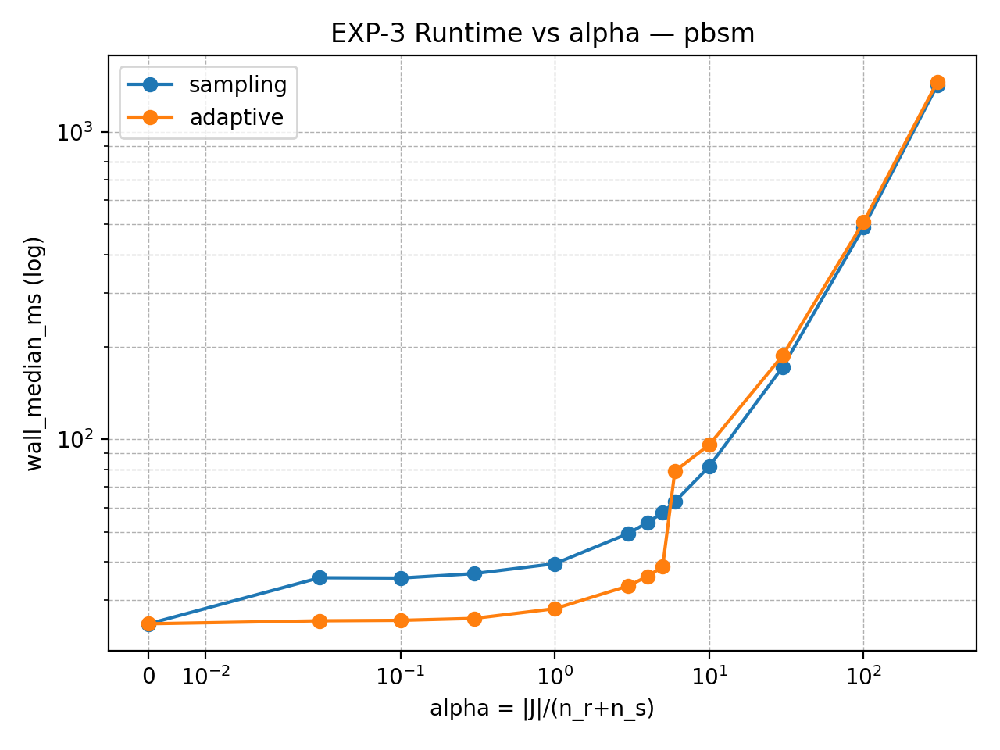

### r_tree

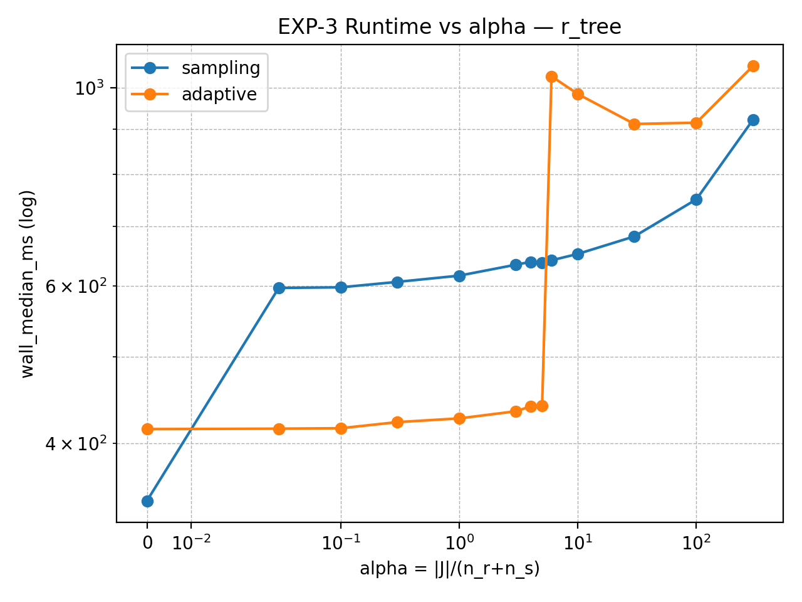

### range_tree

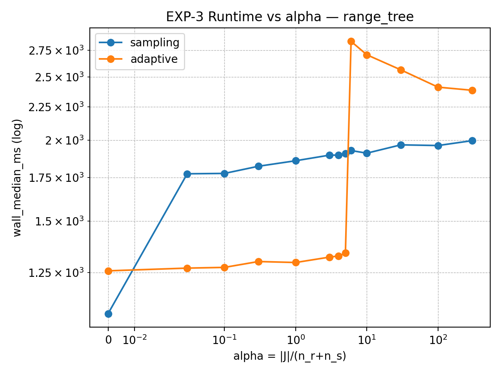

### rejection

### sirs

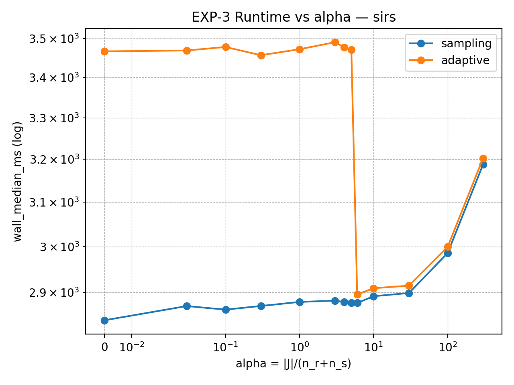

### tlsop

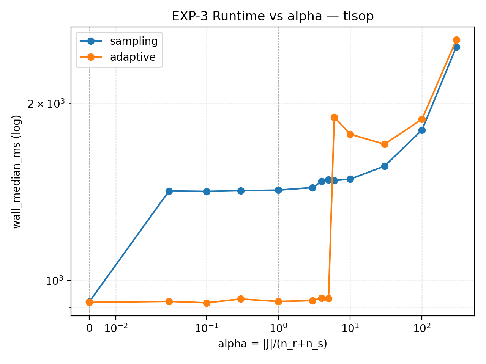
