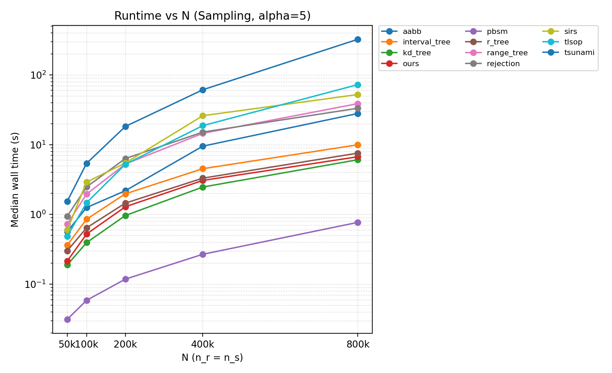
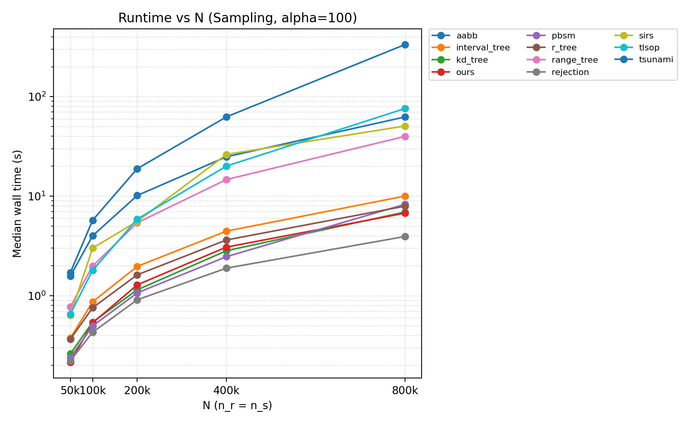
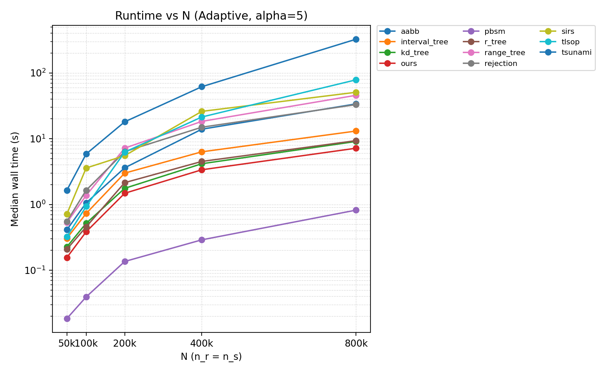
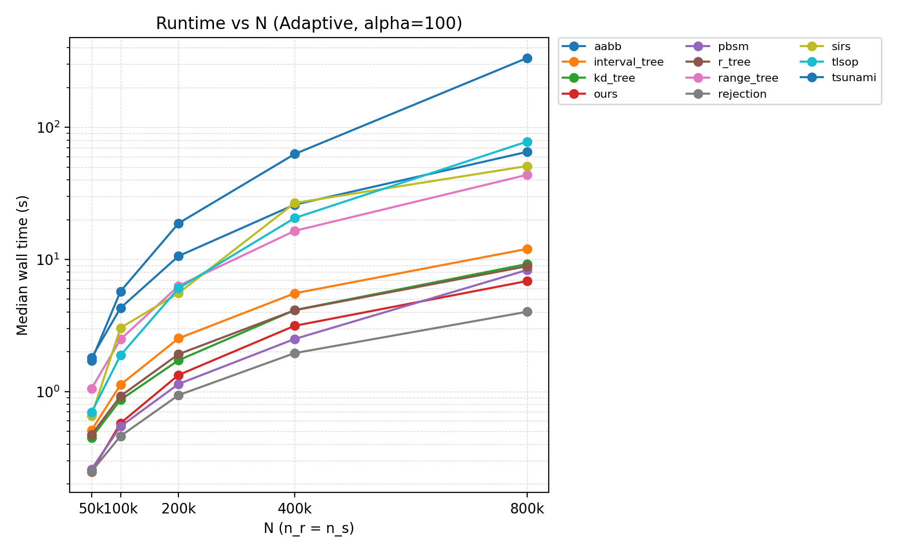
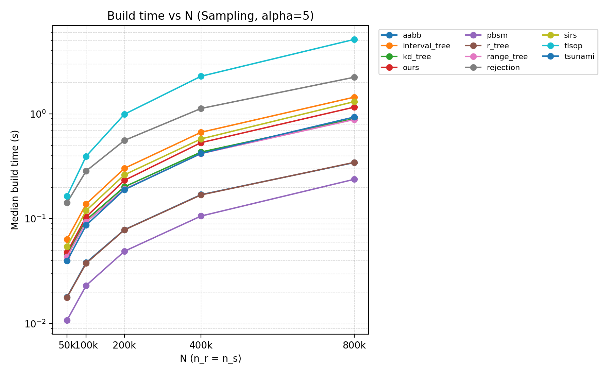
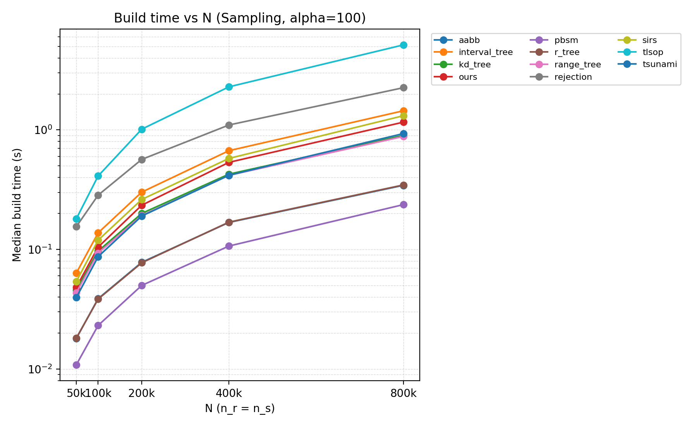
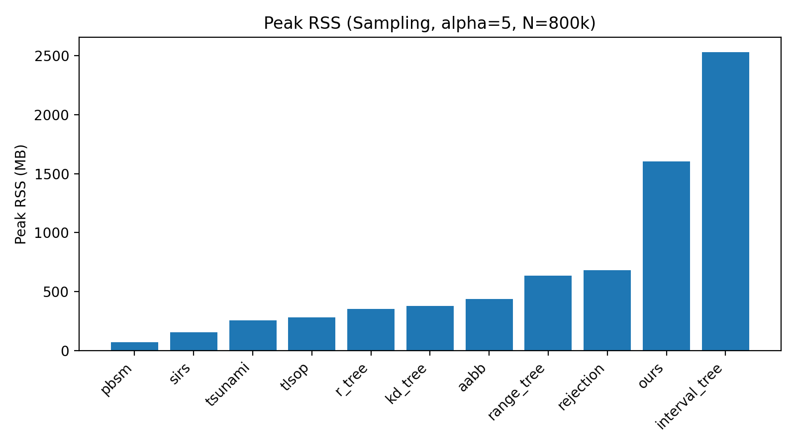
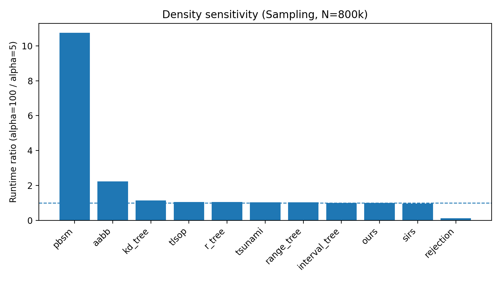

# EXP-4 实验报告：Scalability vs N（RQ4）

> 本报告由 `EXP-4.md`（实验大纲）与 `run_exp4.sh`（执行脚本）共同解释，并以脚本的实际执行为准。

## 0. 快速结论（TL;DR）

- 本次 EXP-4（balanced profile）覆盖 **2 个密度 regime（α=5/100）× 5 个规模 N × 11 个方法 × 3 个变体 × 5 repeats**，全部点位 **exit_code=0**，结果完整可用。

- **α=5（稀疏）**：`pbsm` 在全区间显著最快；`ours` 与 `kd_tree/r_tree` 同量级。

- **α=100（高压力）**：`rejection` 变为最快；`ours` 与 `kd_tree` 非常接近，且 `ours` 对 α 的敏感性极低（α=5 与 α=100 的 runtime 基本一致）。

- **注意：enum_sampling 在 α=100 且 N≥400k 触发 `enum_cap=50M` 截断**，这些点不能作为完整 enum+sampling 的有效性能点（需要在图中标注/排除）。


## 1. 实验的设计

### 1.1 实验目标

EXP-4 对应研究问题 **RQ4：Scalability vs N**。在固定任务语义与资源约束（单线程）下，随规模 \(n_r=n_s=N\) 增大，比较各方法的：

1. **端到端 runtime–N**（主指标，来自程序内部 `wall_ms`，不包含数据生成/加载 I/O）  
2. **Build time–N**（从 `phases_json["run_build_ms"]` 提取，解释瓶颈）  
3. **峰值 RSS**（外部 GNU time 抓取，用于内存表/内存曲线）  
4. **枚举风险与截断行为**（`enum_cap`、`enum_truncated`、adaptive 分支）

本实验更关注“趋势/斜率/瓶颈”，而不是“在所有 regime 永远最快”。


### 1.2 任务定义与公平性约束

- 输入：二维 axis-aligned rectangles 的两关系表 \(R,S\)，统一采用 **half-open 语义** \([L,R)\)。  
- Join：\(J=\{(r,s)\mid r\cap s\neq\emptyset\}\)。  
- 输出：从 \(J\) 中抽取 **t 个 i.i.d.、均匀、with-replacement 的样本对**。  
- 公平性：脚本强制 `THREADS=1` 并设置 `OMP/MKL/OPENBLAS/...` 线程上限，同时 `sjs_run --threads=1`。  
- 计时口径：主图使用 `run.csv` 中的 `wall_ms`（程序内部计时），外部 `time -v` **仅用于 RSS**。


### 1.3 变量与固定参数（本次运行实际配置）

| Key            | Value                                                                               |
|:---------------|:------------------------------------------------------------------------------------|
| RUN_ID         | 20251228_165406                                                                     |
| DATE           | 2025-12-28T16:54:06+00:00                                                           |
| RUN_PROFILE    | balanced                                                                            |
| BUILD_TYPE     | Release                                                                             |
| THREADS        | 1                                                                                   |
| REPEATS        | 5                                                                                   |
| N_LIST         | 50000 100000 200000 400000 800000                                                   |
| T_LIST         | 100000                                                                              |
| REGIMES        | alpha5:5, alpha100:100                                                              |
| METHODS        | ours aabb interval_tree kd_tree r_tree range_tree pbsm tlsop sirs rejection tsunami |
| VARIANTS       | sampling enum_sampling adaptive                                                     |
| EXTRA_RUN_ARGS | --enum_cap=50000000                                                                 |


**运行环境（sysinfo 摘要）：**

- CPU: AMD EPYC 9354 32-Core Processor

- CPU(s): 128 (2 sockets × 32 cores × SMT)

- Mem:          1.0Ti        11Gi       796Gi        36Mi       199Gi       989Gi


### 1.4 数据集与密度控制

本次 EXP-4 使用 SYN-CTRL/stripe 生成可控密度数据。采用密度参数：

\[
\alpha=\frac{|J|}{n_r+n_s}
\]

在 \(n_r=n_s=N\) 时，构造保证：

\[
|J| \approx 2\alpha N
\]

本次 balanced profile 选择两个 regime：

- **α=5**：稀疏匹配压力（\(|J|=10N\)）  
- **α=100**：更高匹配压力（\(|J|=200N\)）

数据生成离线进行并写为 binary（`--dataset_source=binary`），以满足“生成/加载不计入 wall_ms”的口径。


### 1.5 执行流程（run_exp4.sh 的实际行为概括）

`run_exp4.sh` 的核心流水线是：

1. **编译**：CMake 构建 `sjs_gen_dataset` 与 `sjs_run`  
2. **离线生成数据**：对每个 (α,N) 生成 `data/synthetic/exp4/<reg_dir>/exp4_<reg_dir>_N<N>_{R,S}.bin`  
3. **扫点运行**：对每个 (α,t,N,method,variant) 调用一次 `sjs_run`，每点 `repeats=5`  
4. **记录 RSS**：每次运行外层包一层 GNU `time -v`，解析峰值 RSS  
5. **输出汇总表**：每个 (α,t) 输出  
   - `exp4_status.csv`（exit_code、enum_truncated_any 等）  
   - `exp4_rss_peak_kb.csv`（RSS 峰值表）  
6. **落盘**：将 `run/temp/exp4/` 整体复制到 `results/raw/exp4/`（覆盖写）

> 本报告的所有图表均由 `run.csv` 与 `exp4_rss_peak_kb.csv` 汇总计算得到；并提供 `summary/exp4_summary.csv` 作为二次分析入口。


## 2. 实验的结果

### 2.1 完整性与正确性检查

- **运行完整性**：两组 regime 共 330 个点位全部运行完成（`exit_code=0`）。  
- **Join 大小一致性**：所有方法均返回 `count_exact=1`，且 `count_value` 与 SYN-CTRL 理论值 \(|J|=2\alpha N\) 完全一致（下表以 `ours/sampling` 为代表展示）。


|      N |    alpha=5 |   alpha=100 |
|-------:|-----------:|------------:|
|  50000 | 500000     |     1e+07   |
| 100000 |      1e+06 |     2e+07   |
| 200000 |      2e+06 |     4e+07   |
| 400000 |      4e+06 |     8e+07   |
| 800000 |      8e+06 |     1.6e+08 |


### 2.2 Runtime vs N（Sampling 变体）

#### α=5（稀疏）




**N=800k 时（Sampling, α=5）最快 Top-5：**

| method        |   wall_s |   p95_s |   rss_mb |   build_s |
|:--------------|---------:|--------:|---------:|----------:|
| pbsm          |    0.769 |   0.775 |     69.6 |     0.238 |
| kd_tree       |    6.073 |   6.083 |    380.4 |     0.899 |
| ours          |    6.709 |   6.724 |   1603.4 |     1.159 |
| r_tree        |    7.562 |   7.6   |    353   |     0.345 |
| interval_tree |    9.951 |   9.984 |   2531.1 |     1.443 |


#### α=100（高匹配压力）




**N=800k 时（Sampling, α=100）最快 Top-5：**

| method    |   wall_s |   p95_s |   rss_mb |   build_s |
|:----------|---------:|--------:|---------:|----------:|
| rejection |    3.928 |   3.974 |    688.9 |     2.254 |
| ours      |    6.744 |   6.753 |   1602.4 |     1.161 |
| kd_tree   |    6.914 |   6.936 |    408.6 |     0.898 |
| r_tree    |    7.924 |   7.952 |    353.5 |     0.346 |
| pbsm      |    8.273 |   8.311 |     69.5 |     0.237 |


#### 选取代表方法的对比表（Sampling, median wall time, 单位：秒）

> 为避免图中 11 条曲线过密，下表选取 6 个代表方法（ours/pbsm/kd_tree/r_tree/rejection/interval_tree）。


**α=5：**


|      N |   interval_tree |   kd_tree |   ours |   pbsm |   r_tree |   rejection |
|-------:|----------------:|----------:|-------:|-------:|---------:|------------:|
|  50000 |           0.363 |     0.189 |  0.214 |  0.031 |    0.301 |       0.941 |
| 100000 |           0.854 |     0.395 |  0.524 |  0.059 |    0.643 |       2.479 |
| 200000 |           1.975 |     0.965 |  1.289 |  0.118 |    1.453 |       6.32  |
| 400000 |           4.525 |     2.471 |  3.072 |  0.269 |    3.311 |      15.14  |
| 800000 |           9.951 |     6.073 |  6.709 |  0.769 |    7.562 |      33.243 |


**α=100：**


|      N |   interval_tree |   kd_tree |   ours |   pbsm |   r_tree |   rejection |
|-------:|----------------:|----------:|-------:|-------:|---------:|------------:|
|  50000 |           0.374 |     0.26  |  0.214 |  0.239 |    0.365 |       0.221 |
| 100000 |           0.866 |     0.542 |  0.532 |  0.495 |    0.755 |       0.428 |
| 200000 |           1.967 |     1.144 |  1.283 |  1.065 |    1.619 |       0.908 |
| 400000 |           4.449 |     2.826 |  3.075 |  2.465 |    3.626 |       1.889 |
| 800000 |          10.019 |     6.914 |  6.744 |  8.273 |    7.924 |       3.928 |


### 2.3 Runtime vs N（Adaptive 变体）

#### α=5




#### α=100




**Adaptive 分支决策示例（ours）：**


|   alpha | N    | branch            | pilot_pairs   |   enum_truncated |
|--------:|:-----|:------------------|:--------------|-----------------:|
|       5 | 50k  | enumerate_all     | 500,000       |                0 |
|       5 | 100k | enumerate_all     | 1,000,000     |                0 |
|       5 | 200k | fallback_sampling | 1,000,001     |                1 |
|       5 | 400k | fallback_sampling | 1,000,001     |                1 |
|       5 | 800k | fallback_sampling | 1,000,001     |                1 |
|     100 | 50k  | fallback_sampling | 1,000,001     |                1 |
|     100 | 100k | fallback_sampling | 1,000,001     |                1 |
|     100 | 200k | fallback_sampling | 1,000,001     |                1 |
|     100 | 400k | fallback_sampling | 1,000,001     |                1 |
|     100 | 800k | fallback_sampling | 1,000,001     |                1 |


> 解释：当 join 规模 \(|J|\) 超过 `pilot_pairs` 阈值（本次为 1,000,000）时，adaptive 会在 pilot 枚举达到阈值后停止并回退到 sampling，因此 `enum_truncated=1` 在 adaptive 下并不代表失败。


### 2.4 Build time vs N（Sampling 变体）

#### α=5




#### α=100




### 2.5 峰值内存（RSS）

#### α=5, N=800k（Sampling）




#### α=100, N=800k（Sampling）


**N=800k（Sampling, α=5）的 RSS 表（MB）：**


| method        |   rss_mb |   wall_s |
|:--------------|---------:|---------:|
| interval_tree |   2531.1 |    9.951 |
| ours          |   1603.4 |    6.709 |
| rejection     |    680.8 |   33.243 |
| range_tree    |    634.8 |   38.683 |
| aabb          |    436   |   27.963 |
| kd_tree       |    380.4 |    6.073 |
| r_tree        |    353   |    7.562 |
| tlsop         |    283.8 |   72.418 |
| tsunami       |    255.7 |  323.151 |
| sirs          |    156.1 |   52.289 |
| pbsm          |     69.6 |    0.769 |


### 2.6 enum_sampling 的截断情况（重要）

本次脚本统一设置了 `--enum_cap=50000000`。因此在 **α=100 且 N≥400k** 时，理论 join 规模 \(|J|=2\alpha N\) 分别为 80M/160M，都会超过 cap：

- 这些点位的 `enum_sampling` 将被迫截断（`enum_truncated=1`）
- 需要在图中标注为 **truncated / N/A**，不可与完整枚举的性能直接对比


|      N |   enum_sampling_truncated(alpha=100) |
|-------:|-------------------------------------:|
|  50000 |                                    0 |
| 100000 |                                    0 |
| 200000 |                                    0 |
| 400000 |                                    1 |
| 800000 |                                    1 |


## 3. 对实验及其结果的分析

### 3.1 规模扩展性：随 N 增大，谁的斜率更稳？

从 sampling 变体的 runtime–N 曲线可以观察到：

- **`ours` / `kd_tree` / `r_tree`**：整体呈现较平滑的增长趋势，曲线在 α=5 与 α=100 之间几乎重合（尤其是 `ours`）。  
- **`pbsm`**：在 α=5 下非常快，但在 α=100 下斜率明显变陡（随 \(|J|\) 增大而显著变慢）。  
- **`rejection`**：表现出与 `pbsm` 相反的密度趋势——稀疏 regime 下接受率低导致很慢，但在高密度 regime 下接受率升高，从而显著提速。


### 3.2 密度敏感性：α=100 相对 α=5 的变化倍率（N=800k, Sampling）




**倍率表（N=800k, Sampling）：**


| method        |   wall_a5_s |   wall_a100_s |   ratio |
|:--------------|------------:|--------------:|--------:|
| pbsm          |       0.769 |         8.273 |   10.75 |
| aabb          |      27.963 |        62.517 |    2.24 |
| kd_tree       |       6.073 |         6.914 |    1.14 |
| tlsop         |      72.418 |        75.898 |    1.05 |
| r_tree        |       7.562 |         7.924 |    1.05 |
| tsunami       |     323.151 |       333.964 |    1.03 |
| range_tree    |      38.683 |        39.838 |    1.03 |
| interval_tree |       9.951 |        10.019 |    1.01 |
| ours          |       6.709 |         6.744 |    1.01 |
| sirs          |      52.289 |        50.735 |    0.97 |
| rejection     |      33.243 |         3.928 |    0.12 |


解读要点：

- `pbsm` 的倍率约 **10.75×**：说明其运行时间在高匹配压力下显著依赖 \(|J|\)。这与其“更接近 join 枚举/输出敏感”的特征一致。  
- `ours` 倍率约 **1.01×**：几乎不随 α 变化，说明其主要成本由结构构建与事件级采样决定，而不是由 \(|J|\) 规模决定。  
- `rejection` 倍率约 **0.12×**：在 α=100 下比 α=5 快很多，反映出拒绝采样的核心成本是 **(1 / accept-rate)**。


### 3.3 Build vs Query：瓶颈来自哪里？

从 build 曲线可以看到不同方法的“启动成本”差异明显：

- `ours` 的 build 相对偏大（例如 N=800k 时 ~1.16s），但它带来了对密度稳定的采样能力；  
- `pbsm` 的 build 很小（~0.24s），但在 α=100 时 **count/sample 阶段**随 \(|J|\) 明显上升，最终拖慢整体；  
- `interval_tree` 的 build 与 RSS 都较高（N=800k RSS ~2.5GB），属于典型“结构较重”的 baseline。

建议写论文时强调：EXP-4 的目标不是只比一个点的绝对时间，而是解释 “扩展性” 与 “瓶颈阶段”。


### 3.4 关于 enum_sampling 的正确画法

因为 `enum_sampling` 有潜在的输出爆炸风险，脚本用 `enum_cap` 做了统一的安全上限。本次结果中：

- α=5：所有 N 均未截断，`enum_sampling` 可以作为有效点  
- α=100：N≥400k 全部截断，**必须标记为 truncated / N/A**（否则读者会误解为“枚举真的这么快/这么慢”）

如果论文主文希望比较 enum_sampling，可考虑：  
- 在高 α 时只画到不触发 cap 的最大 N；或  
- 提高 cap 并配合更严格的 timeout/内存限制；或  
- 将 enum_sampling 在高 α 的点作为“失败边界”而不是性能点。


### 3.5 本次 EXP‑4 是否“理想”？

本次 EXP‑4 结果整体属于 **“可用且信息量足够”**：趋势、瓶颈与设计意图基本吻合，尤其 `ours` 在 α=5/100 的稳定性是一个很强的论据。

但如果目标是“让 crossover 更有冲击力”，建议补充：

- 将高压力 regime 从 α=100 提升到 α=200（脚本原生支持），更容易观察 `pbsm` 与 `ours` 的交叉点前移/差距扩大；  
- 或在保持 α=100 的同时提高 t（例如 t=1e6），使 sample 阶段差异更显著。

这些属于“增强说服力”的补充实验，而不是修复正确性问题。


## 4. 附录：本报告产物与复现

### 4.1 报告文件结构

- `EXP-4_实验报告.md`：本报告  
- `figures/`：所有图表 PNG  
- `summary/exp4_summary.csv`：汇总表（每个点一行：median/p95 的 wall/build + RSS）

### 4.2 复现命令（与本次结果一致）

```bash
chmod +x run/run_exp4.sh
RUN_PROFILE=balanced bash run/run_exp4.sh
```

### 4.3 重要注意事项

- `results/raw/exp4/` 会被脚本覆盖写；要保留历史建议开启 `KEEP_HISTORY=1` 或手动复制目录  
- 画图时务必处理 `enum_truncated`（尤其是 enum_sampling）
