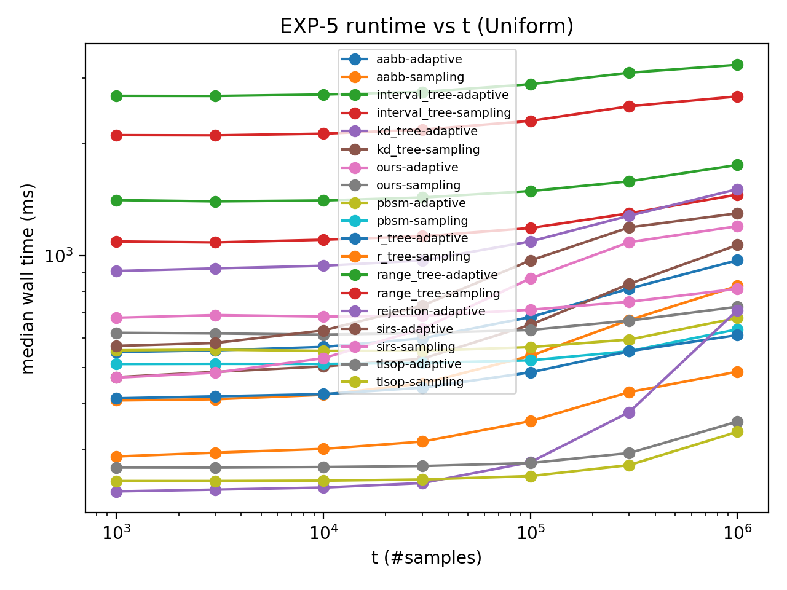
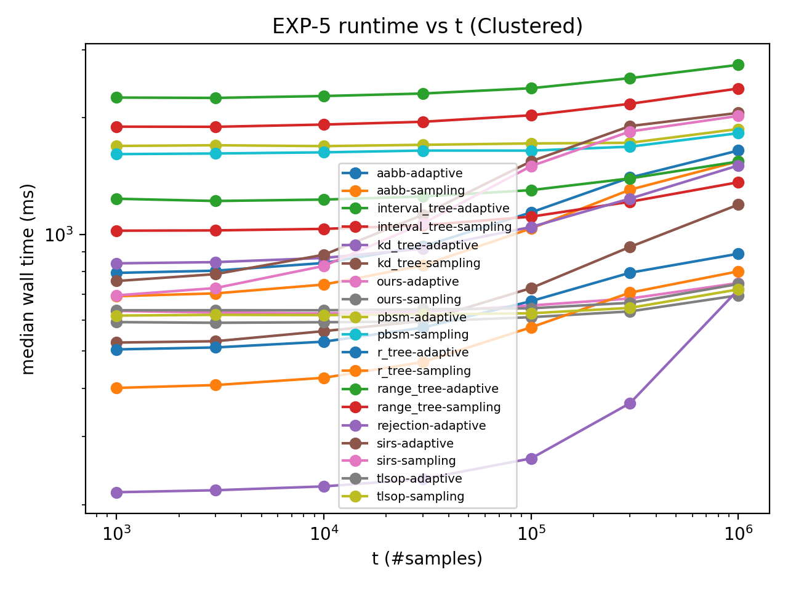
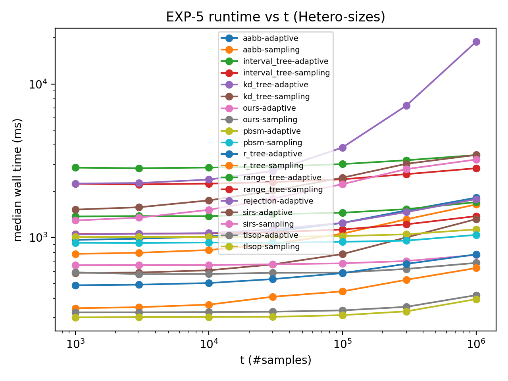
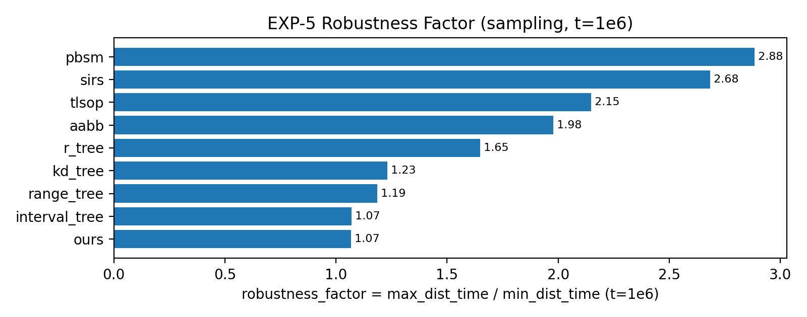
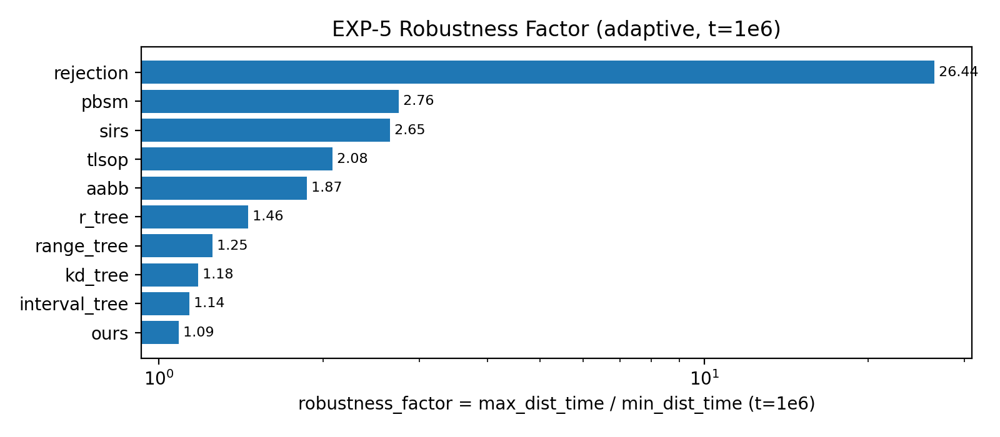

# EXP-5 实验报告：分布迁移鲁棒性（RQ5）

> 生成时间：2025-12-29 15:58:25  
> 本报告基于你提供的 **EXP-5.md**（实验大纲）、**run_exp5.sh**（执行大纲，以它为准）、**exp5_plot_runtime_t.py**（作图规则）以及 **exp5_result.zip**（实际运行产物：CSV/PNG/log/config）。  
> 报告中的所有曲线与数值均可在本压缩包内的 `data/` 与 `figures/` 中复核。

---

## 1. 实验的设计

### 1.1 实验目标（RQ5）

EXP-5 旨在回答 **RQ5：Robustness to distribution shift**：

- 当数据分布从“可控密度构造（SYN-CTRL）”切换到更一般的合成分布后（Uniform / Clustered / Hetero-sizes）：
  1. **runtime vs sample size `t`** 的趋势是否仍然成立？
  2. 哪些 baseline 对 **偏斜（clustered hotspots）** 或 **大小混合（hetero sizes）** 更敏感，出现明显退化？

> 注意：EXP-5 的主指标是 **运行时间（wall time）随 `t` 的变化**。本实验默认 `write_samples=false`、`verify=false`，因此不会把输出样本写盘或做昂贵验证，尽量把测量集中在算法核心开销上。

---

### 1.2 数据设置：3 种 2D synthetic 分布

- 任务：2D AABB（half-open 语义）相交 join 的 i.i.d. uniform sampling（有放回）。
- 规模固定：`n_r = 100000`，`n_s = 100000`。
- 分布三选一（每个分布单独跑一遍完整 sweep）：
  - **Uniform**（均匀随机矩形）
  - **Clustered**（热点聚类偏斜）
  - **Hetero-sizes**（10% 大框 + 90% 小框，且 anisotropic）

> 重要说明（对结果解读非常关键）：  
> EXP-5 配置里有 `alpha=1.0` 字段，但对这三个 generator 来说，`alpha` **不等价于**“把真实 join size `|J|` 控制到某个目标值”。因此解释性能差异时应同时报告每个分布的 **实际 `|J|`**（本报告在 2.1 节给出）。

---

### 1.3 Sweep 维度与方法集合

- 扫描样本量 `t`（共 7 个点）：

  `t ∈ {1000, 3000, 10000, 30000, 100000, 300000, 1000000}`

- methods（默认 10 个）：

  `ours, aabb, interval_tree, kd_tree, r_tree, range_tree, pbsm, tlsop, sirs, rejection`

- variants（EXP-5 仅跑 2 种）：
  - `sampling`
  - `adaptive`（自适应切换：pilot 枚举判断 join 大小是否超过阈值 `J_STAR`，若超过则回退到 sampling）

- 运行重复：`repeats = 3`
- 线程：`threads = 1`（并通过环境变量强制 OMP/MKL/OPENBLAS 等也为 1，保证公平性）
- adaptive 阈值：`J_STAR = 1,000,000`
- `enum_cap = 0`，且 EXP-5 不跑 `enum_sampling`（避免大 join 的内存风险）

---

### 1.4 执行流程与输出产物（以 `run_exp5.sh` 为准）

每个分布都会生成一份 sweep config JSON，然后调用一次 `sjs_sweep`：

- 产物（每个分布目录各一份）：
  - `sweep_raw.csv`：逐次运行记录（含 rep、seed、ok、wall_ms、adaptive 分支等）
  - `sweep_summary.csv`：按（method, variant, t）聚合后的统计（median/p95 等）
  - `runtime_t.png`：从 `sweep_summary.csv` 画出的 runtime vs t 图

作图过滤策略（来自 `exp5_plot_runtime_t.py`）：
- 只保留 `ok_rate == 1.0` 的点位；
- 过滤 `note` 以 `SKIPPED` 开头的点位；
- 过滤非正的 `t` 或 `wall_median_ms`（保证 log 轴可画）。

> 本次结果中，`rejection + sampling` 被框架显式标记为 **SKIPPED**（要求使用 `rejection + adaptive`），因此在图中不会出现 `rejection-sampling` 曲线。

---

## 2. 实验的结果

### 2.1 三个分布的实际 join size（|J|）统计

下表来自各分布的 `sweep_summary.csv`（列 `count_mean`，且在 repeats 中 `count_stdev=0`、`exact_frac=1`，可视作本次实验的实际 `|J|`）：  

| Distribution | Generator | n_r | n_s | \|J\| | avg_degree=\|J\|/(n_r+n_s) | pair_density=\|J\|/(n_r*n_s) |
|---|---|---|---|---|---|---|
| Uniform | uniform | 100000 | 100000 | 6,334,470 | 31.672 | 0.000633 |
| Clustered | clustered | 100000 | 100000 | 21,682,600 | 108.413 | 0.002168 |
| Hetero-sizes | hetero_sizes | 100000 | 100000 | 8,069,310 | 40.347 | 0.000807 |

> 读表要点：Clustered 的 `|J|` 明显更大（约 21.7M），意味着不仅“分布形态变了”，join 密度也同步提升；这会影响很多方法的剪枝效率与活跃集大小。

---

### 2.2 runtime vs t 曲线（直接引用实验输出 PNG）

#### 2.2.1 Uniform

#### 2.2.2 Clustered

#### 2.2.3 Hetero-sizes

---

### 2.3 关键数值：t = 1,000,000 时的端到端 median runtime（ms）

为了把“分布迁移鲁棒性”量化，我们在 `t=1e6` 上做横向对比，并给出：

\[
\text{robustness\_factor} = \frac{\max_{dist} T(dist)}{\min_{dist} T(dist)}.
\]

#### 2.3.1 sampling 变体（t=1e6）

| method | Uniform (ms) | Clustered (ms) | Hetero-sizes (ms) | robust_factor |
|---|---|---|---|---|
| tlsop | 335.467 | 720.354 | 395.437 | 2.147 |
| r_tree | 486.810 | 802.175 | 630.769 | 1.648 |
| pbsm | 632.967 | 1825.920 | 1037.900 | 2.885 |
| ours | 728.049 | 695.359 | 681.696 | 1.068 |
| aabb | 827.730 | 1544.090 | 1638.030 | 1.979 |
| kd_tree | 1068.090 | 1193.300 | 1314.820 | 1.231 |
| sirs | 1199.230 | 2023.170 | 3218.500 | 2.684 |
| interval_tree | 1458.950 | 1363.180 | 1375.390 | 1.070 |
| range_tree | 2681.350 | 2381.650 | 2823.000 | 1.185 |

配套图（robustness factor 越接近 1 越稳健）：

#### 2.3.2 adaptive 变体（t=1e6）

| method | Uniform (ms) | Clustered (ms) | Hetero-sizes (ms) | robust_factor |
|---|---|---|---|---|
| tlsop | 357.349 | 743.809 | 419.786 | 2.081 |
| r_tree | 610.672 | 890.750 | 774.505 | 1.459 |
| pbsm | 678.947 | 1871.570 | 1127.270 | 2.757 |
| rejection | 712.968 | 719.788 | 18848.500 | 26.437 |
| ours | 813.658 | 748.184 | 768.150 | 1.088 |
| aabb | 971.021 | 1646.520 | 1814.450 | 1.869 |
| sirs | 1299.100 | 2059.920 | 3448.720 | 2.655 |
| kd_tree | 1509.390 | 1506.460 | 1775.210 | 1.178 |
| interval_tree | 1753.340 | 1542.270 | 1696.670 | 1.137 |
| range_tree | 3262.290 | 2741.460 | 3440.380 | 1.255 |

配套图（注意横轴为 log scale，以容纳 `rejection` 的极端波动）：

---

### 2.4 Adaptive 实际走了哪个分支？

EXP-5 里 adaptive 的目标是“枚举足够小的 join，遇到大 join 则回退 sampling”。本次结果在 `sweep_raw.csv` 中可直接看到分支信息：  

| Distribution | adaptive_branch (unique) | adaptive_pilot_pairs | used_enumeration | enum_truncated |
|---|---|---|---|---|
| Uniform | fallback_sampling | 1,000,001 | 0 | 1 |
| Clustered | fallback_sampling | 1,000,001 | 0 | 1 |
| Hetero-sizes | fallback_sampling | 1,000,001 | 0 | 1 |

这意味着：在三个分布下，由于 `|J|` 都大于 `J_STAR = 1e6`，adaptive 都做了 `1,000,001` 对的 pilot 枚举后 **回退到 sampling**，从而在 runtime 上带来额外开销（这也解释了多数方法在 `adaptive` 下比 `sampling` 略慢）。

---

## 3. 对实验及其结果的分析

### 3.1 总体结论（EXP-5 是否“讲得通”）

从结果看，EXP-5 的主要叙事是成立且清晰的：

1. **分布迁移确实会改变 baseline 的相对表现**：例如 `pbsm`、`sirs`、`aabb` 在 Clustered/Hetero-sizes 下出现显著变慢（robustness factor 约 2–3 倍）。
2. **存在非常强的“分布敏感方法”的证据**：`rejection-adaptive` 在 Hetero-sizes 下出现灾难性退化（t=1e6 时约 18.85s），robustness factor 约 26×。
3. **我们的方案（ours）在三分布下非常稳健**：  
   - sampling：robustness factor ≈ **1.07**（三分布几乎不变）  
   - adaptive：robustness factor ≈ **1.09**  
   在“分布迁移鲁棒性”这一维度上，ours 的信号非常干净。

---

### 3.2 现象解释：为什么会这样？

#### (A) Clustered：局部高密度 + |J| 暴涨

Clustered 的 `|J|` 约 21.7M（是 Uniform 的 ~3.4×），这会同时带来：
- 活跃集更大、候选更多；
- 空间索引节点 overlap 更严重、剪枝变差；
- 分区/排序类方法更容易出现负载不均（热点区域成为瓶颈）。

因此多个 baseline 在 Clustered 下明显变慢属于合理现象。

#### (B) Hetero-sizes：少量大框破坏剪枝 / 破坏 rejection acceptance

Hetero-sizes 中有 `p_large=0.1` 的大框，并且大框尺寸在 `[0.1, 0.3]` 量级。直观影响是：
- 树结构（R-tree/AABB-tree/Range-tree）节点 MBR overlap 增大，剪枝失效；
- 分区（PBSM/TLSOP）中，覆盖多个 tile 的大框会显著增加跨块交互；
- **对 rejection 类方法最致命**：候选空间被大框显著扩大，导致 accept rate 下降，从而需要更多 proposal 才能得到有效 join pair，runtime 急剧上升。

这与 EXP-5 的“结论期待”高度一致，也使得该实验具有很强说服力。

---

### 3.3 对论文写作/展示的建议（基于这次结果）

- 主文建议至少展示：
  1) 三分布的 `|J|`（一张小表即可）；
  2) 三张 runtime-vs-t 图（或主文放 Hetero-sizes、其余放附录）；
  3) 一张 robustness factor 图（尤其 adaptive 图里 `rejection` 的 26× 是很强的论据）。

- 对 adaptive 的解释建议在文中明确一句：
  - “在本实验的三个分布下，真实 join size 都超过阈值 `J_STAR=1e6`，因此 adaptive 均回退到 sampling；adaptive 的性能可视为 sampling + pilot overhead。”

---

### 3.4 可选的增强实验（如果你希望 EXP-5 更难被挑刺）

1. 多个 `GEN_SEED`：每个分布至少 3 个 seed（1/2/3），跨 seed 聚合 median/p95 → “鲁棒性”更有统计意义。
2. 让 adaptive 真正触发分支：在某些分布下把 `J_STAR` 调小/调大，或额外加一个低密度数据点，使得 adaptive 在一部分 case 走枚举分支；这样可以更完整地展示 adaptive 的价值。

---

## 附录：本报告随包提供的原始材料索引

- 运行曲线（来自原始结果）：`figures/runtime_t_*.png`
- 结果 CSV（来自原始结果）：
  - `data/uniform_t_sweep_summary.csv`, `data/uniform_t_sweep_raw.csv`
  - `data/clustered_t_sweep_summary.csv`, `data/clustered_t_sweep_raw.csv`
  - `data/hetero_t_sweep_summary.csv`, `data/hetero_t_sweep_raw.csv`
- 复现配置：`configs/exp5_t_*.json`
- 元信息：`meta/manifest.txt`, `meta/sysinfo.txt`, `meta/run_exp5.sh`
