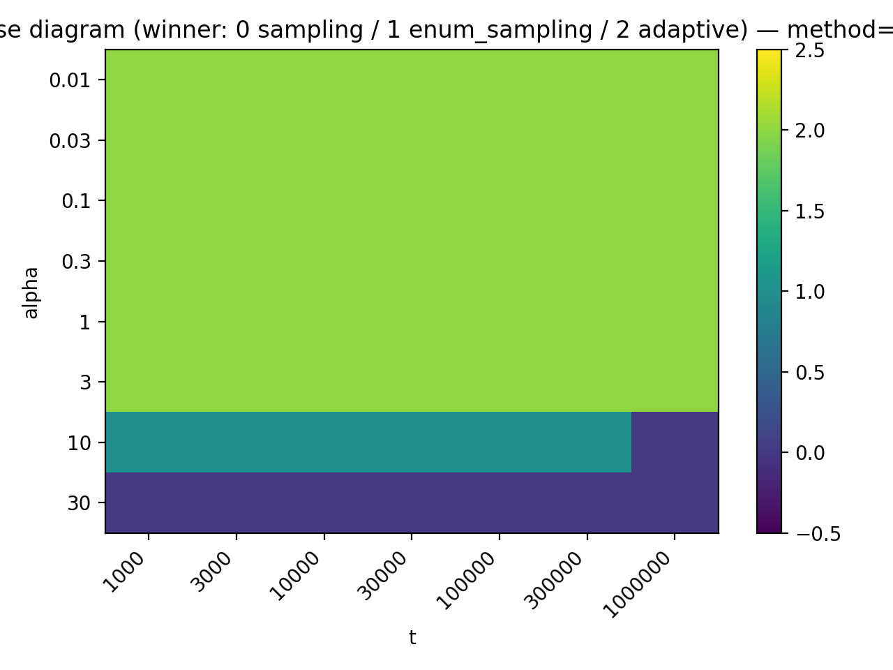
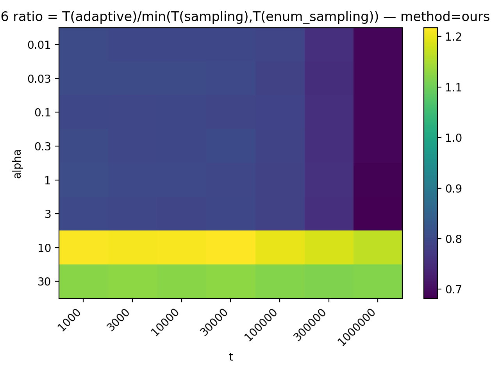
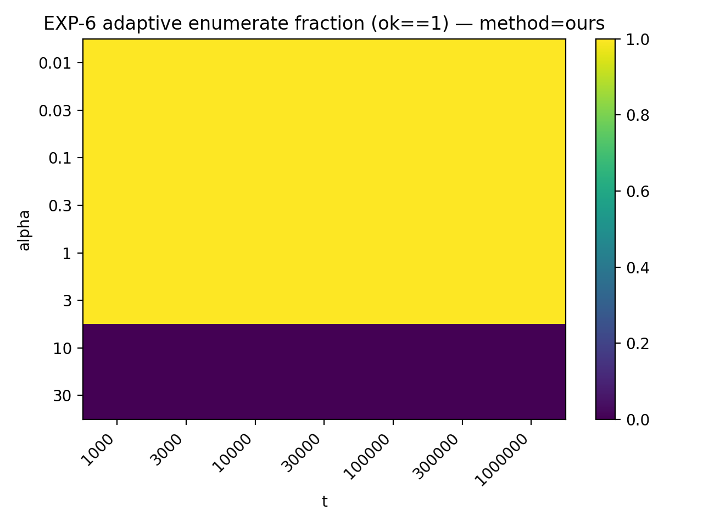

# EXP-6 实验报告：自适应策略在 $(\alpha,t)$ 网格下的“接近最优”验证（RQ6）

> 本报告基于一次实际执行产物生成：`data/sweep_summary.csv`、`data/sweep_raw.csv`、`meta/manifest.txt`、以及 `figs/` 下的图与矩阵 CSV。  
> 其中 **Shell 执行大纲**是权威执行口径：`repro/run_exp6.sh`；绘图逻辑来自：`repro/exp6_plot.py`；原始实验说明来自：`spec/EXP-6.md`。

---

## 0. 实验配置一览

| 项目 | 取值 |
| --- | --- |
| 时间戳 | 2025-12-29T08:54:24+0000 |
| 数据集生成器 | synthetic / stripe (stripe_ctrl_alpha) |
| 维度 | 2D（half-open box） |
| 规模 | n_r=100000，n_s=100000（总数=200000） |
| 密度定义 | $\alpha = |J|/(n_r+n_s)$（stripe 保证 $|J|=\mathrm{round}(\alpha\cdot(n_r+n_s))$） |
| 方法(method) | ours |
| 变体(variant) | sampling,enum_sampling,adaptive |
| 网格 α | 0.01,0.03,0.1,0.3,1,3,10,30 |
| 网格 t | 1000,3000,10000,30000,100000,300000,1000000 |
| repeats | 3 |
| 线程 | 1 |
| 生成 seed | 1 |
| 运行 seed | 1 |
| 自适应阈值 $J_\star$ | 1,000,000（理论拐点 $\alpha_\star \approx 5$） |
| enum_cap | 0 |

---

# 1. 实验的设计

## 1.1 目标（RQ6）

EXP-6 对应研究问题 **RQ6：Adaptivity effectiveness**：

- 在不同的 join 压力（用 $\alpha$ 控制）与样本量 $t$ 的组合下，
- **Adaptive** 是否能够自动选择接近最优的分支（`sampling` 或 `enum_sampling`），
- 使端到端时间接近：
  $$
  \min\{T(\mathrm{sampling}),\ T(\mathrm{enum\_sampling})\}.
  $$

> 注意：EXP-6 的输出目标始终是：返回 **$t$ 个来自 $J$ 的 i.i.d. 均匀、有放回样本对**（join 关系 $J$ 上均匀）。

## 1.2 任务定义（空间连接 + half-open 语义）

- 输入：两集合 $R,S$，元素为 2D 轴对齐矩形（half-open）：
  $$
  r=[L_x(r),R_x(r))\times[L_y(r),R_y(r)),
  $$
- Join 条件：$r\cap s\neq\emptyset$（**边界贴合不算相交**）

## 1.3 数据与工作负载：stripe（SYN-CTRL）

EXP-6 使用合成生成器 **stripe / stripe_ctrl_alpha**，核心原因是它能把“密度参数”变成稳定的 join 规模：

- 密度定义：
  $$
  \alpha = \frac{|J|}{n_r+n_s}
  $$
- stripe 生成器保证：
  $$
  |J| = \mathrm{round}(\alpha\cdot(n_r+n_s)).
  $$

这样我们可以在 $\alpha$ 维度上“可控地从稀疏扫到稠密”，并把自适应切换边界画成相图。

## 1.4 被比较的 3 种运行模式（variant）

对每个 method（本次仅 `ours`），固定比较：

1. `sampling`：不物化全部 $J$，直接返回 $t$ 个 i.i.d. 样本  
2. `enum_sampling`：先枚举全部 $J$，再从枚举结果做均匀采样  
3. `adaptive`：当 $|J|$ 小时倾向枚举；当 $|J|$ 大时回退到 sampling

自适应阈值参数：

- `j_star = J_\star = 1,000,000`
- 理论拐点：
  $$
  \alpha_\star \approx \frac{J_\star}{n_r+n_s} \approx 5
  $$

## 1.5 Sweep 网格与计时口径

- 网格：$\alpha\in\{0.01,0.03,0.1,0.3,1,3,10,30\}$，$t\in\{1000,3000,10000,30000,100000,300000,1000000\}$
- repeats=3，threads=1
- 主要指标：**端到端 wall time**（`wall_median_ms`，并保留 `p95`）

## 1.6 实际执行流程（以 Shell 为准）

本次执行的真实流水线由 `repro/run_exp6.sh` 驱动：

1. CMake 配置与编译（`build_type=Release`）
2. 生成 sweep 配置 `repro/exp6_alpha_t.json`
3. 运行：`sjs_sweep --config=exp6_alpha_t.json`
4. 产出：`data/sweep_raw.csv` 与 `data/sweep_summary.csv`
5. 绘图：`python3 repro/exp6_plot.py ...` 输出到 `figs/`

绘图脚本的重要规则（与设计一致）：

- 只使用 `ok_rate==1` 的点参与 phase/ratio
- `SKIPPED/UNSUPPORTED/TRUNC/CAP` 点视为 NA（不会污染 oracle(min)）

---

# 2. 实验的结果（基于本次 run 的实际产物）

## 2.1 完整性与正确运行情况

- `sweep_summary.csv` 中所有行均 `ok_rate == 1`
- `enum_cap = 0`（没有因为 cap 截断 enum_sampling 的情况）

这保证了 phase/ratio 图不会被“失败点/截断点”误导。

## 2.2 Phase diagram（赢家相图）

下图展示每个 $(\alpha,t)$ 网格点上三种 variant 谁最快：

- 0：`sampling` 赢
- 1：`enum_sampling` 赢
- 2：`adaptive` 赢

赢家分布统计（56 个格点）：

| winner | 含义 | 格点数(共56) |
| --- | --- | --- |
| 0 | sampling 最快 | 8 |
| 1 | enum_sampling 最快 | 6 |
| 2 | adaptive 最快 | 42 |
| -1 | NA/缺失 | 0 |

> 结论（从赢家相图直接读）：  
> - 在 $\alpha\le 3$ 的稀疏 join 区域，本次实验中 `adaptive` 全面占优；  
> - 在 $\alpha=30$ 的稠密 join 区域，`sampling` 全面占优；  
> - 在 $\alpha=10$ 的过渡区，`enum_sampling` 在大部分 $t$ 上更快，但在 $t=10^6$ 时 `sampling` 反超。

## 2.3 Ratio heatmap（接近 oracle(min) 的程度）

ratio 定义为（与实验设计一致）：
$$
\mathrm{ratio} = \frac{T(\mathrm{adaptive})}{\min(T(\mathrm{sampling}),\ T(\mathrm{enum\_sampling}))}.
$$

- ratio ≈ 1：adaptive 接近 oracle(min)
- ratio > 1：adaptive 比 oracle(min) 慢（存在 pilot/切换开销）
- ratio < 1：adaptive 比两条基线更快（可能来自工程路径差异/分支避免额外工作等）

总体 ratio 统计（全部 56 个格点）：

| 统计量 | 数值 |
| --- | --- |
| min | 0.682 |
| median | 0.798 |
| mean | 0.872 |
| max | 1.218 |

按 $\alpha$ 汇总（含 join size 与 adaptive 分支比例）：

| α | |J| | adaptive枚举分支比例 | ratio中位数 | ratio范围(min–max) |
| --- | --- | --- | --- | --- |
| 0.01 | 2,000 | 1.0 | 0.797 | 0.689–0.805 |
| 0.03 | 6,000 | 1.0 | 0.801 | 0.689–0.807 |
| 0.1 | 20,000 | 1.0 | 0.793 | 0.689–0.798 |
| 0.3 | 60,000 | 1.0 | 0.796 | 0.690–0.804 |
| 1 | 200,000 | 1.0 | 0.795 | 0.685–0.808 |
| 3 | 600,000 | 1.0 | 0.794 | 0.682–0.801 |
| 10 | 2,000,000 | 0.0 | 1.210 | 1.165–1.218 |
| 30 | 6,000,000 | 0.0 | 1.122 | 1.114–1.127 |

## 2.4 Adaptive 的分支选择（枚举 vs 回退采样）

下图展示 adaptive 在每个 $(\alpha,t)$ 点位上走 **枚举分支**的比例（0~1）：

这张图验证了一个关键事实：

- 在 $\alpha\le 3$：adaptive **100% 选择枚举**
- 在 $\alpha\ge 10$：adaptive **100% 回退采样**

与理论拐点 $\alpha_\star\approx 5$ 的“方向”一致，但由于本次网格在 3 与 10 之间缺少更密的点，因此切换边界只能被定位到区间 $(3,10)$。

## 2.5 一个直观的数值切片（固定 $t=10^5$）

为了更直观地量化三个 variant 的端到端时间，下表固定 $t=10^5$，列出各 $\alpha$ 的 `wall_median_ms`（单位 ms）以及 ratio：

| α | |J| | sampling(ms) | enum_sampling(ms) | adaptive(ms) | oracle=min(ms) | ratio |
| --- | --- | --- | --- | --- | --- | --- |
| 0.01 | 2,000 | 508.8 | 468.0 | 371.1 | 468.0 | 0.793 |
| 0.03 | 6,000 | 515.9 | 469.7 | 368.7 | 469.7 | 0.785 |
| 0.1 | 20,000 | 510.3 | 469.6 | 370.7 | 469.6 | 0.789 |
| 0.3 | 60,000 | 511.5 | 468.6 | 371.1 | 468.6 | 0.792 |
| 1 | 200,000 | 513.9 | 475.9 | 374.9 | 475.9 | 0.788 |
| 3 | 600,000 | 515.2 | 483.5 | 380.0 | 483.5 | 0.786 |
| 10 | 2,000,000 | 518.9 | 507.3 | 608.6 | 507.3 | 1.200 |
| 30 | 6,000,000 | 518.2 | 550.1 | 579.6 | 518.2 | 1.119 |

---

# 3. 对实验及其结果的分析

## 3.1 自适应切换是否“符合预期”？

**符合预期（方向正确）**：

- 理论上 $\alpha_\star\approx 5$ 是自适应从“枚举更快”走向“采样更稳”的拐点。
- 观测到的分支切换确实发生在 $\alpha=3$ 与 $\alpha=10$ 之间，并且在高密度区域完全回退采样。

**但定位不够精细**：  
当前 $\alpha$ 网格在拐点附近较稀疏（缺少 4/5/6/8），因此难以把“相变式切换”画得更锋利；若要写进论文正文，建议在 $\alpha_\star$ 附近加密网格。

## 3.2 为什么高密度区域 ratio 明显 > 1？

从 `sweep_raw.csv` 的 `adaptive_pilot_pairs` 字段可以看到：

- 当 $\alpha\ge 10$ 时，adaptive 的 `adaptive_pilot_pairs` 恒为 **1,000,001**（且 `adaptive_branch=fallback_sampling`）。
- 这意味着 adaptive 在回退采样之前，总是先做一段固定规模的 pilot 枚举，确认 $|J|>J_\star$。

因此在高密度区域，adaptive 会稳定背着一笔 pilot 成本，导致：

- $\alpha=10$：ratio 约 1.17–1.22
- $\alpha=30$：ratio 约 1.11–1.13

**解释上是自洽的**，但如果你的目标叙事是 “adaptive 贴近 oracle(min)（ratio≈1）”，那么这里的“固定 pilot 成本”需要在论文中主动解释，或通过策略改进降低这部分开销。

可行的改进方向（不改变实验定义，仅改实现策略）：

- 在 pilot 阶段更早做“廉价判别”以减少枚举对数量（例如用更轻量的计数估计或分层采样做上界判定）
- 或者把 pilot 阶段产生的部分结果用于后续 sampling（避免浪费）

## 3.3 为什么低密度区域 ratio 系统性 < 1？

在 $\alpha\le 3$ 区域，adaptive 一直走 `enumerate_all` 分支，并且 ratio 稳定在 ~0.77–0.80（甚至有 ~0.68）。

这意味着：**在这些格点上，adaptive 比 sampling 与 enum_sampling 两条基线都更快**。

这并不一定是“异常”——EXP-6 的定义里，oracle(min) 只是两条基线的最小值，而 adaptive 的枚举分支可能采用了更轻的实现路径（例如：一次枚举物化后用极轻量的随机下标采样），而 enum_sampling baseline 可能更偏向“可泛化/严格两遍”的实现方式，导致常数更大。

如果你要把 ratio<1 作为亮点写进论文，建议补充一句解释：

- 这说明 adaptive 的 small-join 分支不仅“选对了方向”，在工程实现上也做到了低常数；并且在该区域它自然退化为“枚举 + 轻量采样”的最优路径。

## 3.4 本次 EXP-6 结果的总体评价（面向论文叙事）

- **强项**：adaptive 的分支切换逻辑非常清晰，且在 56 个格点中有 42 个格点直接成为最快（phase diagram 一眼可读）。  
- **需要解释/优化的点**：高密度区域 ratio>1 是“可解释但不够漂亮”的结果，核心原因是 pilot 成本固定存在。  
- **建议补强**：
  1. 在 $\alpha_\star$ 附近加密 $\alpha$ 网格（4/5/6/8 等）
  2. 将 repeats 从 3 提升到 5 或 7（降低偶然波动）
  3. 在附录对比一次 adaptive 分支的阶段分解（pilot 枚举 vs sampling）来量化 overhead 组成

---

## 附录：本报告打包内文件索引

- 规格与脚本  
  - `spec/EXP-6.md`：实验设计说明  
  - `repro/run_exp6.sh`：执行大纲（权威）  
  - `repro/exp6_plot.py`：绘图方法  
  - `repro/exp6_alpha_t.json`：本次 sweep 配置  

- 实验产物  
  - `data/sweep_summary.csv`：聚合统计（median/p95/ok_rate）  
  - `data/sweep_raw.csv`：逐次运行 raw 记录（含 adaptive_branch/pilot_pairs）  
  - `figs/*.png`：相图 / ratio / adaptive 分支热图  
  - `figs/*.csv`：phase/ratio/branch 的矩阵版本（便于二次出图）  
  - `meta/manifest.txt`、`meta/sysinfo.txt`：环境与参数快照  
  - `logs/*.log`：构建、运行、绘图日志
