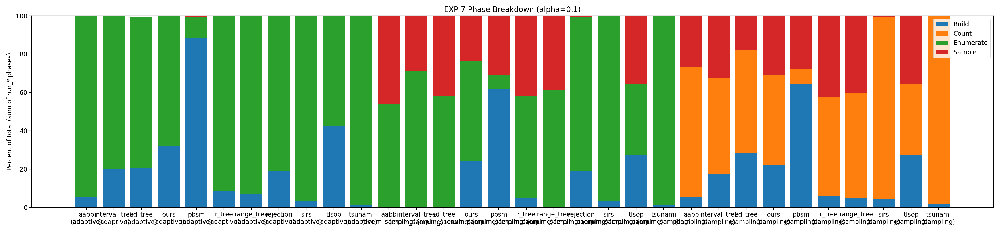
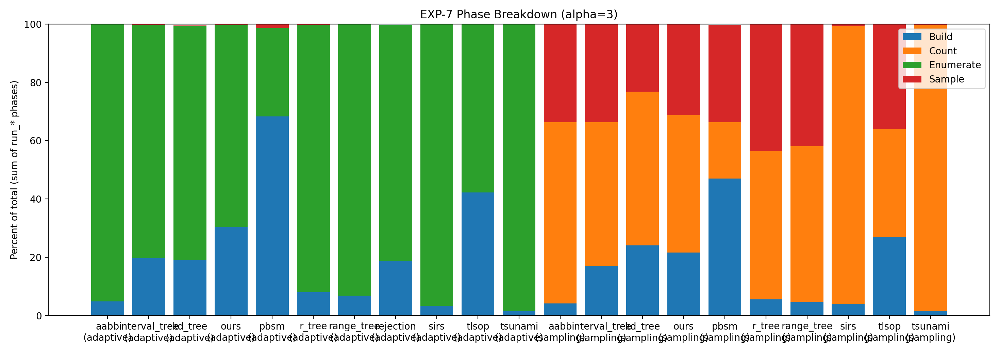
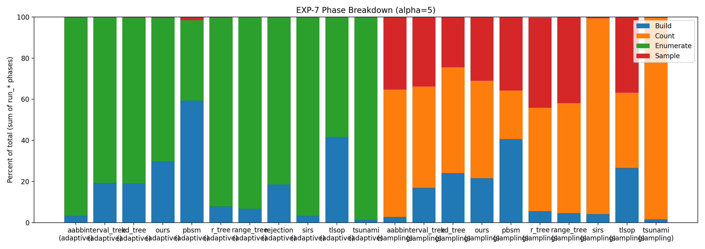
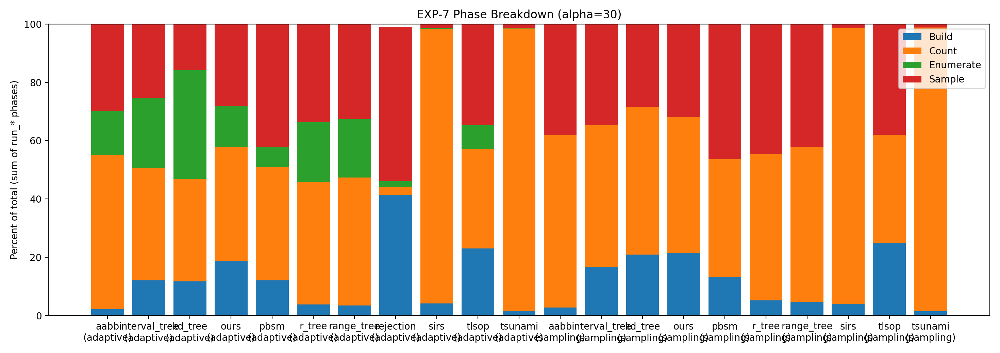

# EXP-7 实验报告：阶段分解与解释性 Profiling（Phase Breakdown）

本报告基于你提供的 **EXP-7 实验结果包（CSV + 图 + 配置快照）** 自动整理生成，内容完全对齐本次实际执行脚本 `run_exp7.sh` 的口径（包括：`ALPHAS="0.1 3 5 30"`、`EXCLUDE_ENUM_TRUNCATED=0` 等关键修正）。

---

## 1. 实验的设计

### 1.1 实验目标（EXP-7 在整套实验中的作用）

EXP-7 是一个 **解释性/剖析型实验（explanatory profiling）**，不是为了“再报一次谁最快”，而是为了回答：

- **时间到底花在 Build / Count / Enumerate / Sample 的哪一段？**
- 为什么某些方法随 **t** 的增长更线性（Sample 段主导）或更平坦（Count 段主导）？
- **Adaptive** 在不同密度（α）下为什么会“枚举”或“回退采样”，以及拐点成本结构是什么？

因此 EXP-7 的核心产物是：在少数代表性 α 点上，对每个 `method × variant` 给出阶段拆分（表 + 堆叠柱图）。

### 1.2 任务定义（与主线实验一致）

- 输入：二维 half-open 轴对齐矩形集合 **R** 与 **S**
- Join 结果：  
  \[
  J = \{(r,s) \mid r\cap s \neq \emptyset \}
  \]
  其中矩形采用 half-open 语义（边界贴合不算相交）。
- 目标：从 \(J\) 中抽取 **t 个 i.i.d.、均匀（uniform）、有放回样本**。

> EXP-7 不改变任务语义，只改变“计时与拆分”的测量方式。

### 1.3 工作负载与参数（以本次实际运行结果为准）

下面这张表来自 `provenance/MANIFEST.txt`（随结果包一起保存），用于固定本次 EXP-7 的关键口径与可复现参数：

| 项                         | 值                                                                                  |
|:---------------------------|:------------------------------------------------------------------------------------|
| 时间戳                     | 20251229_085916                                                                     |
| Git commit                 | ebb23ac75a11e3f01e87904e9949436682ce52f7                                            |
| Build 类型                 | Release                                                                             |
| NR / NS                    | 100000 / 100000                                                                     |
| t (每次采样数)             | 100000                                                                              |
| 重复次数 (repeats)         | 3                                                                                   |
| 线程数 (THREADS)           | 1                                                                                   |
| 密度点 (ALPHAS)            | 0.1 3 5 30                                                                          |
| 方法集合 (METHODS)         | ours aabb interval_tree kd_tree r_tree range_tree pbsm tlsop sirs rejection tsunami |
| Adaptive 阈值 J_STAR       | 1000000                                                                             |
| 枚举上限 ENUM_CAP          | 0                                                                                   |
| 只在稀疏点跑 enum_sampling | INCLUDE_ENUM_SPARSE=1 (SPARSE_ALPHA=0.1)                                            |
| 后处理过滤 enum_truncated  | EXCLUDE_ENUM_TRUNCATED=0 (0=保留 pilot 截断)                                        |

#### 密度点为何选择 `0.1 / 3 / 5 / 30`？
本项目使用的密度定义为：

\[
\alpha = \frac{|J|}{n_r + n_s}
\]

本次 `n_r=n_s=100000`，因此 `n_r+n_s=200000`，而 `J_STAR=1000000` 对应的理论拐点约为：

\[
\alpha_\star \approx \frac{J_\star}{n_r+n_s} = \frac{10^6}{2\times10^5} = 5
\]

所以在 `0.1, 3, 30` 之外额外加入 `5`，能更清晰解释 adaptive 的分支拐点（这是 `run_exp7.sh` 的实际默认设置）。

### 1.4 执行流程（run_exp7.sh 的真实跑法）

本次 EXP-7 的运行逻辑可以概括为 4 步：

1. **构建**：`cmake` 生成并编译可执行文件 `sjs_sweep`  
2. **生成 sweep_config.json**：调用 `exp7_make_sweep_config.py` 产出两份配置  
   - `sampling + adaptive`：在所有 `ALPHAS` 上跑  
   - `enum_sampling`：仅在稀疏点 `SPARSE_ALPHA=0.1` 上跑（防止 dense 枚举爆炸）  
3. **跑 sweep**：`sjs_sweep --config=...` 输出 `sweep_raw.csv` 与 `sweep_summary.csv`
4. **后处理与画图**：`exp7_postprocess_phase_breakdown.py`  
   - 解析 `phases_json`  
   - 聚合 repeats 的 **median**  
   - 产出 breakdown 表（CSV/MD）与按 α 分图的堆叠柱图

### 1.5 阶段定义与统计口径（postprocess 脚本映射规则）

EXP-7 的“阶段拆分”以 `phases_json` 为准，并用以下映射汇总到四大类阶段：

- **sampling**
  - Build = `run_build_ms`
  - Count = `run_count_ms`
  - Sample = `run_sample_ms`
- **enum_sampling**
  - Build = `run_build_ms`
  - Enumerate = `run_enum_prepare_ms + run_enum_pass1_count_ms`
  - Sample = `run_draw_ranks_ms + run_enum_pass2_select_ms`
- **adaptive**
  - Build = `run_build_ms`
  - Enumerate (pilot) = `run_pilot_enum_prepare_ms + run_pilot_enum_scan_ms`
  - Count (fallback) = `run_fallback_count_ms`
  - Sample = `run_fallback_sample_ms + run_small_join_sample_from_list_ms`

并且：阶段百分比的分母默认是

\[
\texttt{total} = \sum_{k\in\text{phases}} \texttt{run\_\*\_ms}
\]

（这会让 Build%+Count%+Enum%+Sample% 更接近 100%；`wall_ms` 作为 sanity check 单独保留。）

---

## 2. 实验的结果

### 2.1 结果包中包含的关键产物

本报告打包时包含（并在本 zip 中一并提供）：

- `figs/exp7_phase_breakdown_alpha_*.png`：按 α 分图的阶段堆叠柱图（本报告将直接引用）
- `data/exp7_breakdown_median.csv`：阶段拆分（median over repeats）
- `data/exp7_breakdown_median.md`：阶段拆分 Markdown 表（可直接贴论文/README）
- `data/exp7_merged_sweep_raw.csv`：合并后的 raw（每个 repeat 一行）
- `data/sampling_adaptive/` 与 `data/enum_sparse/`：对应的 raw / summary / sweep_config 快照
- `configs/`：生成 sweep config 的 JSON（便于复现）
- `provenance/`：MANIFEST、env、关键日志（便于审计）

### 2.2 Join 大小自洽性（alpha 控制是否真的生效）

在 controlled stripe 生成器下，理论上 \(|J|\approx \alpha(n_r+n_s)\)。本次结果中 `count_value` 的中位数与理论值高度一致（除了 rejection 在 dense 下是近似 count，其它几乎全 exact）：

| **α**   | **Branch (分支策略)** | **Pilot Pairs Median** | **Enum Truncated Rate** | **Count Exact Rate** | **Count Value Median** | **Expected (预期值)** |
| ------- | --------------------- | ---------------------- | ----------------------- | -------------------- | ---------------------- | --------------------- |
| **0.1** | enumerate_all         | 20,000                 | 0                       | 100%                 | 20,000                 | 20,000                |
| **3**   | enumerate_all         | 600,000                | 0                       | 100%                 | 600,000                | 600,000               |
| **5**   | enumerate_all         | $10^6$                 | 0                       | 100%                 | $10^6$                 | $10^6$                |
| **30**  | fallback_sampling     | $10^6$                 | 1                       | 90.9%                | $6 \times 10^6$        | $6 \times 10^6$       |

> 读法提示：
> - `expected_|J|_from_alpha` 是 \(\alpha(n_r+n_s)\)
> - `count_value_median` 是实际 runner 报告的 median join size
> - `count_exact_rate<1` 的原因是：**rejection** 在 dense fallback 时采用近似 count（这是预期行为之一）

### 2.3 Adaptive 分支行为（EXP-7 的“机制证据”核心）

Adaptive 的设计是：先 pilot 枚举探测；若 \(|J|\le J_\star\) 则 `enumerate_all`，若 \(|J|>J_\star\) 则 `fallback_sampling`。

本次结果在所有方法上都呈现出非常清晰的两段式行为：

|   alpha | adaptive_branch   |   runs |
|--------:|:------------------|-------:|
|     0.1 | enumerate_all     |     33 |
|     3   | enumerate_all     |     33 |
|     5   | enumerate_all     |     33 |
|    30   | fallback_sampling |     33 |

并且在 α=30 的 fallback 里，`adaptive_pilot_pairs` 恒为 `J_STAR + 1 = 1,000,001`（说明 pilot 精确跑到触发阈值为止，且我们 **保留了 enum_truncated==1 的记录**，没有被后处理误删）。

### 2.4 阶段分解图（按 α 分图）

下面 4 张图是 EXP-7 的核心结果。每张图固定一个 α，横轴为 `method (variant)`，纵轴为 **phases_json 口径**下的阶段百分比（Build / Count / Enumerate / Sample）。

#### α = 0.1（稀疏，小 join）

#### α = 3（中等密度，join 仍在阈值之下）

#### α = 5（阈值附近，|J|≈J_STAR）

#### α = 30（稠密，|J|≫J_STAR，adaptive 统一回退采样）

### 2.5 关键数值示例：`ours` 的阶段拆分（median）

为了便于在论文里解释“我们的时间花在哪”，这里给出 `ours` 在各 α 与各 variant 下的 median 分解（ms + %）：

|   alpha | variant       |   build_ms |   count_ms |   enum_ms |   sample_ms |   run_total_ms_from_phases |   wall_ms |   build_pct |   count_pct |   enum_pct |   sample_pct |
|--------:|:--------------|-----------:|-----------:|----------:|------------:|---------------------------:|----------:|------------:|------------:|-----------:|-------------:|
|     0.1 | adaptive      |    104.627 |      0     |   221.54  |       0.31  |                    326.409 |   366.208 |      32.054 |       0     |     67.872 |        0.095 |
|     3   | adaptive      |    101.746 |      0     |   232.227 |       1.155 |                    335.143 |   379.096 |      30.359 |       0     |     69.292 |        0.345 |
|     5   | adaptive      |    101.971 |      0     |   237.713 |       1.2   |                    340.895 |   383.799 |      29.913 |       0     |     69.732 |        0.352 |
|    30   | adaptive      |    102.42  |    211.438 |    76.254 |     152.444 |                    542.208 |   585.722 |      18.889 |      38.996 |     14.064 |       28.115 |
|     0.1 | enum_sampling |    102.525 |      0     |   223.804 |      99.885 |                    426.537 |   465.969 |      24.037 |       0     |     52.47  |       23.418 |
|     0.1 | sampling      |    103.973 |    219.618 |     0     |     143.686 |                    466.971 |   507.696 |      22.265 |      47.03  |      0     |       30.77  |
|     3   | sampling      |    101.624 |    221.103 |     0     |     148.931 |                    469.222 |   512.749 |      21.658 |      47.121 |      0     |       31.74  |
|     5   | sampling      |    101.852 |    222.574 |     0     |     149.215 |                    470.503 |   513.251 |      21.647 |      47.306 |      0     |       31.714 |
|    30   | sampling      |    102.442 |    222.14  |     0     |     152.04  |                    476.702 |   521.112 |      21.49  |      46.599 |      0     |       31.894 |

> 完整的全方法 breakdown 表请见：`data/exp7_breakdown_median.md`  
> 原始逐次运行数据（每个 repeat 一行）请见：`data/exp7_merged_sweep_raw.csv`

---

## 3. 对实验及其结果的分析

### 3.1 Adaptive 的拐点机制被“干净地”呈现出来了

从 2.3 的分支统计可见：

- α=0.1 / 3 / 5：全部 `enumerate_all`
- α=30：全部 `fallback_sampling`

并且 pilot 的枚举规模：
- 在阈值以下：pilot_pairs = |J|（直接枚举完）
- 在阈值以上：pilot_pairs = J_STAR + 1（刚超过阈值即停止）

这使得 EXP-7 能非常直接地向读者解释：
- **为什么 adaptive 在稀疏时非常像“枚举法”**（Sample 几乎为 0）
- **为什么在稠密时依然会看到一段固定的 Enumerate 开销**（pilot 探测成本），但总体不会爆炸（因为随后切换到 fallback 的 Count+Sample）

### 3.2 sampling vs adaptive：阶段结构差异解释了主线趋势

在相同的 t 下：

- **sampling**：永远需要 Count + Sample（因此通常 Count%/Sample% 会占主导）
- **adaptive**：  
  - sparse：Enum% 主导（因为直接枚举 join）  
  - dense：Count%/Sample% 主导，同时额外承担 pilot Enum% 的固定开销

这解释了你们在主线实验中常见的两类现象：
- 某些方法随 t 增长更明显：Sample% 占比高 → t 增长时更“线性”
- 某些方法对 α 更敏感：Enum% 或 Count% 在 α 变大后急剧上升 → 出现退化或拐点

### 3.3 `ours` 的“可解释瓶颈”非常稳定

从 `ours` 的表可见：

- sampling 下：Build/Count/Sample 占比在各 α 上都非常稳定（Build≈21% / Count≈47% / Sample≈31%）
- adaptive 下：  
  - 阈值以下（α≤5）几乎纯枚举（Enum≈68–70%）  
  - 阈值以上（α=30）进入 fallback（Count≈39%、Sample≈28%，Enum≈14% 来自 pilot）

这类“结构稳定 + 阈值行为可解释”的结果，非常适合作为论文中对 **RQ2/RQ3/RQ6** 的解释性证据。

### 3.4 关于 `wall_ms` vs `total_ms(phases)` 的差值（建议写进图注）

你会注意到部分方法在某些点上 `wall_ms` 会略大于 `sum(run_*_ms)`。这是因为：
- EXP-7 的 breakdown 使用 phases_json（只统计 runner 内部显式标注的 run_* scope）
- 少量框架开销/重置/校验不在任何 run_* scope 中

建议在论文图注中固定写一句口径：
> “阶段占比以 phases_json 中 `run_*` 计时求和为 100%，wall_ms 单独报告作 sanity check。”

### 3.5 Rejection 的两个“预期例外”需要在论文里显式声明

在本结果里：
1. `rejection + sampling` 组合在 sweep harness 中被 **SKIPPED**（所以 breakdown 表中不会出现 `rejection/sampling`）
2. `rejection` 在 dense fallback 下 `count_exact=0`、`count_value` 为近似（因此 `count_exact_rate<1`）

这两点都不是“实验失败”，但如果论文不写清楚，会被误解为“漏跑/不公平”。建议在 EXP-7 的实验设置段落明确一句。

---

## 附录：如何快速定位数据与图

- 图：`figs/exp7_phase_breakdown_alpha_*.png`
- breakdown（全方法）：`data/exp7_breakdown_median.md`
- breakdown（CSV）：`data/exp7_breakdown_median.csv`
- merged raw（每个 repeat 一行）：`data/exp7_merged_sweep_raw.csv`
- 复现参数：`provenance/MANIFEST.txt` 与 `configs/*.json`
